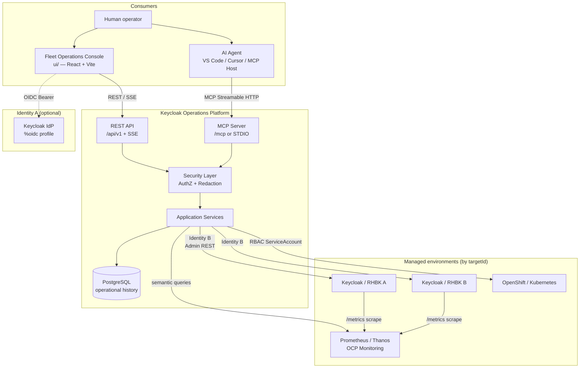
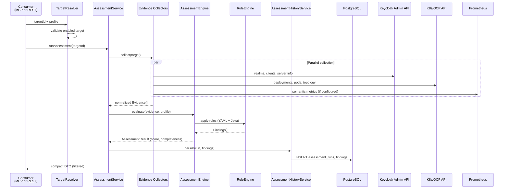
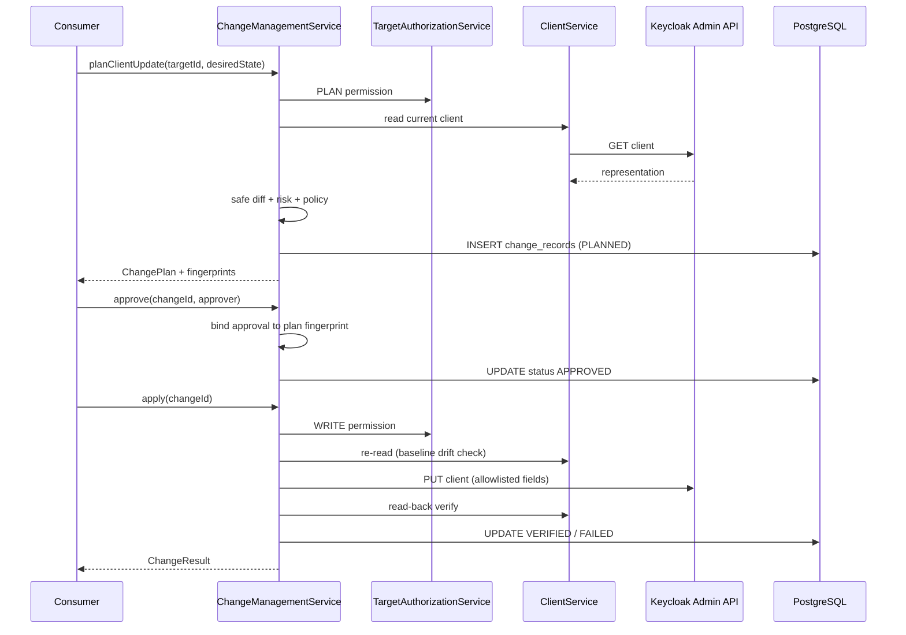
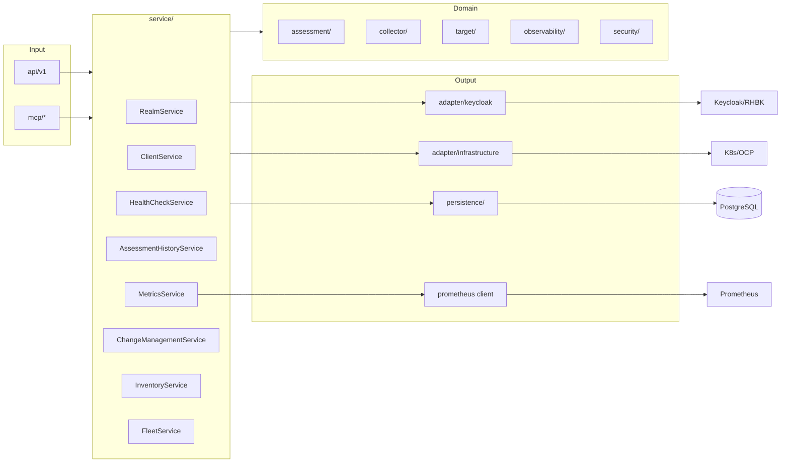
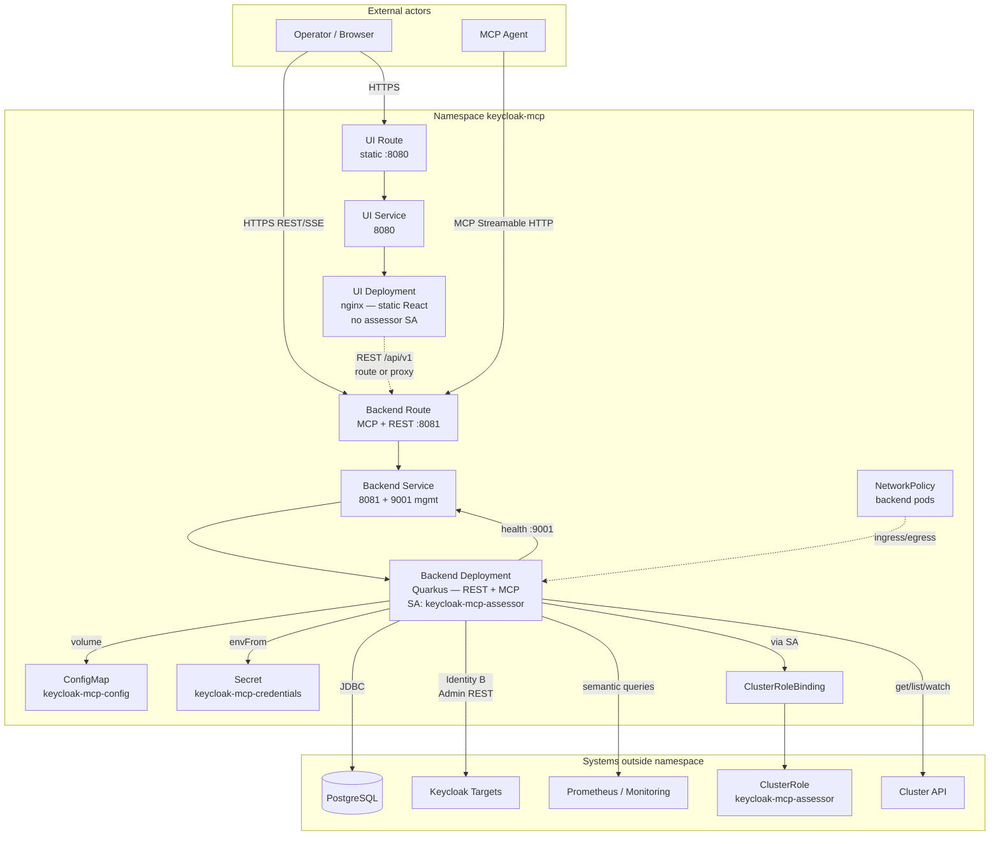

# High-Level Design — Keycloak / RHBK Operations Platform

**Version:** 0.8.0-SNAPSHOT  
**Artifact:** `io.github.keycloakmcp:keycloak-operations-mcp`  
**Repository:** https://github.com/csfreitas/keycloak-operations

---

## 1. System Overview and Business Objectives

### 1.1 What It Is

The **Keycloak / RHBK Operations Platform** is an operational platform that centralizes administration, diagnostics, operational health, production-readiness assessment, and semantic metrics for [Keycloak](https://www.keycloak.org/) and [Red Hat build of Keycloak (RHBK)](https://docs.redhat.com/en/documentation/red_hat_build_of_keycloak) environments.

The solution exposes two consumption interfaces over the **same application service layer**:

| Interface | Consumer | Protocol |
|-----------|----------|----------|
| **MCP Server** | AI agents (VS Code, Cursor, etc.) | Model Context Protocol — Streamable HTTP (`/mcp`) or STDIO |
| **REST API** | Fleet Operations Console (`ui/`) and integrations | HTTP JSON `/api/v1` + SSE (`/api/v1/events`) |

The web console and AI agents **never** access Keycloak Admin, Kubernetes/OpenShift, Prometheus, or PostgreSQL directly. Every interaction goes through the backend, which applies target isolation, sensitive data redaction, auditing, and deterministic policies.

### 1.2 Business Problem

Operators and platform teams need to answer, in a repeatable and auditable way, questions such as:

- What is the health status and HA posture of my Keycloak/RHBK environments?
- Are there security or production misconfigurations in realms, clients, or infrastructure?
- How is performance (latency, errors, pools, JVM) in each environment?
- How can administrative changes be applied in a controlled manner, with approval and verification?

In organizations with **multiple environments** (DEV, HML, PRD), the platform provides a unified control point with isolation by `targetId`, preventing AI agents or operators from supplying arbitrary URLs (SSRF mitigation).

### 1.3 Business Objectives

| Objective | How the platform addresses it |
|-----------|-------------------------------|
| **Multi-environment operations** | Registration of multiple Keycloak/RHBK targets with known credentials and endpoints |
| **Structured diagnostics** | Operational health checks independent of readiness assessments |
| **Deterministic assessment** | Evidence → Rules → Findings engine; LLM does not decide PASS/FAIL |
| **Semantic observability** | Metrics via semantic catalog; no PromQL exposed to clients |
| **Controlled administration** | Plan → approve → apply → verify cycle with fingerprints and per-environment policies |
| **Auditability** | Sanitized audit events persisted in PostgreSQL |
| **Hybrid human + AI experience** | Web console for operators; MCP for LLM-assisted agents |

### 1.4 Current Scope (milestone 0.8)

**Implemented:**

- Keycloak/RHBK administrative read (realms, clients, users, groups, roles, server info)
- OpenShift/Kubernetes infrastructure inventory (target-aware)
- Assessment engine with profiles and YAML rule packs
- Health checks with persisted history
- Semantic metrics (Prometheus, Thanos, OpenShift Monitoring)
- Flyway persistence V1–V7 (targets, assessments, health, audit, snapshots, changes)
- Fleet Operations Console (React)
- Controlled administration — POC for non-sensitive client update

**Out of scope / known limitations:**

- Full realm/client/user/flow/IdP administration (milestones 0.8.1–0.8.4)
- Destructive operations, password/secret workflows
- Multi-replica SSE (in-process fan-out)
- VM inventory
- Operator multi-tenancy (future)

---

## 2. High-Level Architecture

### 2.1 Architectural Principles

1. **Multi-target by design** — every operation identifies a registered `targetId`; URLs never come from the client/LLM ([ADR 0001](../../../adr/0001-multi-target-by-design.md), [ADR 0004](../../../adr/0004-no-arbitrary-endpoints-from-mcp.md)).
2. **MCP and REST share services** — controllers and tools are thin facades; logic lives in `service/`.
3. **Admin REST as boundary** — Keycloak integration via stable Admin REST, not internal APIs ([ADR 0002](../../../adr/0002-admin-rest-as-keycloak-integration-boundary.md)).
4. **Deterministic assessment** — Evidence → Rules → Findings; scoring and policies are code/YAML ([ADR 0003](../../../adr/0003-deterministic-assessment-engine.md)).
5. **PostgreSQL is not a TSDB** — operational history in PG; time series in Prometheus ([ADR 0005](../../../adr/0005-postgresql-is-not-a-tsdb.md)).
6. **Semantic metrics** — no exposed PromQL; queries bound to target ([ADR 0006](../../../adr/0006-semantic-metrics-instead-of-raw-promql.md)).
7. **Controlled changes** — plan/approve/apply/verify; LLM does not decide risk or approval ([ADR 0007](../../../adr/0007-plan-approve-apply-change-model.md)).
8. **Read-only by default** — `mcp.read-only=true`; writes require explicit opt-out + WRITE permission.

### 2.2 Logical Layers

```text
┌─────────────────────────────────────────────────────────────────────────┐
│  Consumers                                                               │
│  ┌──────────────────┐  ┌──────────────────┐  ┌──────────────────────┐ │
│  │ Fleet Console    │  │ MCP Agents       │  │ REST Integrations    │ │
│  │ (ui/ — React)    │  │ (VS Code/Cursor) │  │ (future)             │ │
│  └────────┬─────────┘  └────────┬─────────┘  └──────────┬───────────┘ │
└───────────┼─────────────────────┼────────────────────────┼──────────────┘
            │ REST/SSE            │ MCP HTTP/STDIO         │ REST
┌───────────▼─────────────────────▼────────────────────────▼──────────────┐
│  Input adapters (facade)                                                 │
│  api/v1/* (REST)                    mcp/* (@Tool keycloak_*)             │
└───────────┬─────────────────────────────────────────────────────────────┘
            │
┌───────────▼─────────────────────────────────────────────────────────────┐
│  Application service layer                                               │
│  RealmService, ClientService, AssessmentHistoryService,                  │
│  HealthCheckService, MetricsService, ChangeManagementService,            │
│  InventoryService, FleetService, SnapshotService, AuditQueryService      │
└───────────┬─────────────────────────────────────────────────────────────┘
            │
┌───────────▼─────────────────────────────────────────────────────────────┐
│  Cross-cutting domain                                                    │
│  target/ (registry, resolver)  security/ (redaction, authz)             │
│  assessment/ (engine, profiles)  collector/ (evidence)                   │
│  observability/ (metrics providers)  audit/  credential/                │
└───────────┬─────────────────────────────────────────────────────────────┘
            │
┌───────────▼─────────────────────────────────────────────────────────────┐
│  Output adapters                                                         │
│  adapter/keycloak/ (Admin Client)  adapter/infrastructure/ (Fabric8)    │
│  observability/metrics/prometheus/  persistence/ (JPA + Flyway)          │
└───────────┬─────────────────────────────────────────────────────────────┘
            │
┌───────────▼─────────────────────────────────────────────────────────────┐
│  External systems                                                        │
│  Keycloak/RHBK  OpenShift/K8s  Prometheus/Thanos  PostgreSQL             │
└───────────────────────────────────────────────────────────────────────────┘
```

### 2.3 Main Components

#### 2.3.1 Backend (`keycloak-operations-mcp`)

| Package / module | Responsibility |
|------------------|----------------|
| `api/v1/` | Versioned REST controllers (`/api/v1`) — fleet, targets, assessments, health, metrics, inventory, changes, audit, events (SSE) |
| `mcp/` | MCP tools (`keycloak_*`) — thin facade over services |
| `service/` | Domain orchestration — Keycloak admin, platform, change management |
| `target/` | `TargetRegistry`, `TargetResolver`, multi-target configuration, capabilities |
| `adapter/keycloak/` | `StableAdminApiAdapter`, mappers without secrets |
| `adapter/infrastructure/` | `InfrastructureClientFactory` — Fabric8 K8s/OCP clients |
| `collector/` | Normalized evidence collection for assessment |
| `assessment/` | `AssessmentEngine`, `RuleEngine`, profiles, scoring |
| `observability/` | `MetricsProvider`, factory, semantic queries, bounds |
| `persistence/` | JPA entities, repositories, mappers — operational history |
| `security/` | `SensitiveDataFilter`, `TargetAuthorizationService`, read-only gates |
| `credential/` | `ConfigCredentialProvider` — resolves `credentialRef` |
| `audit/` | `AuditService`, `AuditEventPersister` — sanitized structured logs |
| `discovery/` | Environment detection (K8s/OCP/VM) |
| `config/` | `ConfigMapping` — metrics, health, discovery, retention |

#### 2.3.2 Frontend (`ui/` — Fleet Operations Console)

| Area | Responsibility |
|------|----------------|
| `api/` | Typed HTTP client for `/api/v1` |
| `pages/` | Fleet, overview, health, assessment, performance, infrastructure, history, changes |
| `auth/` | `AuthProvider` — OIDC-ready (`VITE_AUTH_MODE`) |
| `hooks/` | `useFleet`, `useTargetOverview`, `useEvents` (SSE) |

Production packaging: static nginx image (`ui/Containerfile`), separate from the Quarkus pod.

#### 2.3.3 Persistence

PostgreSQL with Flyway migrations:

| Migration | Content |
|-----------|---------|
| V1 | `targets`, `target_tags` |
| V2 | `assessment_runs`, `assessment_findings` |
| V3 | `health_check_runs`, `health_check_results` |
| V4 | `audit_events` |
| V5 | `environment_snapshots`, `inventory_snapshots` |
| V6 | Assessment depth columns + subject in findings |
| V7 | `change_records` — change lifecycle |

#### 2.3.4 Targets and External Providers

Each **Target** represents a registered Keycloak/RHBK environment with:

- `targetId`, type, environment (DEV/TEST/HML/PRD), tags
- Keycloak configuration (URL, auth-realm, client-id, `credential-ref`)
- Optional infrastructure configuration (namespace, cluster)
- Optional observability configuration (Prometheus/OCP Monitoring)

Resolution flow:

```text
targetId → TargetResolver → TargetRegistry → Target
         → CredentialProvider (Identity B)
         → KeycloakClientFactory / InfrastructureClientFactory / MetricsProviderFactory
```

### 2.4 Main Functional Flows

#### 2.4.1 Administrative Read

```text
MCP/REST → TargetAuthorizationService (READ)
         → *Service (Realm, Client, User, …)
         → StableAdminApiAdapter → Keycloak Admin REST
         → RepresentationMapper (no secrets)
         → SensitiveDataFilter → response
         → AuditService (optional)
```

#### 2.4.2 Assessment

```text
MCP/REST → AssessmentService
         → Collectors (Keycloak, K8s/OCP, Metrics)
         → normalized Evidence[]
         → AssessmentEngine + RuleEngine (YAML + Java)
         → Findings + Score
         → AssessmentHistoryService → PostgreSQL
         → SensitiveDataFilter → compact response (no evidence dump)
```

Health check is **independent**: answers "is it up?" vs. assessment which answers "is it ready for production?".

#### 2.4.3 Semantic Metrics

```text
MCP/REST → MetricsService
         → MetricsProviderFactory (target-bound)
         → PrometheusApiClient / OpenShift Monitoring
         → SemanticMetricResult (pre-defined catalog)
         → REST/MCP + MetricsEvidenceCollector → Assessment
```

#### 2.4.4 Controlled Administration (write)

```text
MCP/REST → ChangeManagementService.plan()
         → read current state → safe diff → risk → per-environment policy
         → ChangePlan (fingerprints)
         → approve (bound to fingerprint)
         → apply (Admin REST; stale-plan protection)
         → verify (read-back)
         → change_records + audit
```

#### 2.4.5 Fleet Console

```text
Browser → nginx (ui/) → REST /api/v1
       → FleetService / TargetOverviewService / …
       → PostgreSQL (history) + live calls (Keycloak/metrics/K8s)
SSE: GET /api/v1/events — in-process events (assessment/health completed)
```

### 2.5 Identity Model (Two Identities)

| Identity | Direction | Purpose |
|----------|-----------|---------|
| **Identity A** | Operator → Platform | OIDC on REST/UI (`%oidc` profile); default lab = OPEN_LAB |
| **Identity B** | Platform → Target Keycloak | `credentialRef` via `CredentialProvider`; never exposed to UI/LLM |

Rule: never mix Identity A tokens into target Admin clients.

### 2.6 Deployment

| Environment | Components |
|-------------|------------|
| **Local (dev)** | `podman compose` — PostgreSQL, Keycloak(s), Prometheus; Quarkus `:8081`; Vite `:5173` |
| **OpenShift** | Manifests in `deploy/openshift/` — backend (ServiceAccount + ClusterRole), UI nginx, Routes, NetworkPolicy, Secrets |
| **Kubernetes** | `deploy/kubernetes/deployment.yaml` |

Default ports:

- Application HTTP: `8081` (REST + MCP)
- Management: `9001` (`/q/health`, `/q/metrics`, OpenAPI)

---

## 3. Architecture Diagrams (Mermaid)

### 3.1 Context View — Actors and Systems



### 3.2 Data Flow — Assessment End-to-End



### 3.3 Data Flow — Change Management



### 3.4 Backend Internal Architecture — Packages



### 3.5 OpenShift Deployment (Logical View)

Logical view aligned with manifests in `deploy/openshift/`. The actual namespace is `keycloak-mcp` (not `kc-ops`). `NetworkPolicy` applies only to backend pods; the UI pod does not mount the assessor ServiceAccount.



**Components and flows not shown in the diagram above:**

| Element | Role |
|---------|------|
| `ClusterRole` + `ClusterRoleBinding` | Grant the `keycloak-mcp-assessor` ServiceAccount inventory permissions on the cluster |
| Port `9001` (management) | `/q/health`, `/q/metrics`, and OpenAPI — exposed by the backend Service, not the public Route by default |
| Replicas | Backend and UI with `replicas: 2` in current manifests |
| Isolated UI | `automountServiceAccountToken: false` — no cluster credentials in the nginx pod |
| Identity A (optional) | Browser authenticates via OIDC (`%oidc`) before calling `/api/v1/*` |

---

## 4. Technologies and Libraries Used

### 4.1 Backend (Java / Quarkus)

| Technology | Version | Use |
|------------|---------|-----|
| **Java** | 21 | Runtime |
| **Quarkus** | 3.38.1 | Cloud-native framework, DI (Arc), REST, config |
| **Quarkiverse MCP Server** | 1.13.1 | MCP server (HTTP Streamable + STDIO profile) |
| **Keycloak Admin Client** | 26.0.12 | Stable Admin REST integration |
| **Hibernate ORM Panache** | (Quarkus BOM) | JPA persistence |
| **Flyway** | (Quarkus BOM) | Schema migrations |
| **PostgreSQL JDBC** | (Quarkus BOM) | Database driver |
| **Fabric8 Kubernetes Client** | (Quarkus BOM) | K8s/OCP inventory |
| **Fabric8 OpenShift Client** | (Quarkus BOM) | OpenShift APIs |
| **SnakeYAML** | 2.4 | Assessment rule packs |
| **SmallRye Health** | (Quarkus BOM) | Platform health checks |
| **Micrometer + Prometheus** | (Quarkus BOM) | Platform metrics (`/q/metrics`) |
| **OpenTelemetry** | (Quarkus BOM) | Distributed tracing |
| **SmallRye Fault Tolerance** | (Quarkus BOM) | Resilience (timeouts, circuit breaker) |
| **Quarkus OIDC** | (Quarkus BOM) | Identity A (`%oidc` profile) |
| **SmallRye OpenAPI** | (Quarkus BOM) | REST documentation (`/q/openapi`) |
| **Hibernate Validator** | (Quarkus BOM) | Input validation |
| **Quarkus Scheduler** | (Quarkus BOM) | Scheduled jobs (retention — future) |

**Build:** Maven 3.x, `quarkus-maven-plugin`, `stdio` and `native` profiles.

### 4.2 Frontend (`ui/`)

| Technology | Version | Use |
|------------|---------|-----|
| **Node.js** | ≥ 20 | Build runtime |
| **React** | 18.3.x | UI components |
| **React Router** | 6.28.x | SPA routing |
| **TypeScript** | 5.6.x | Static typing |
| **Vite** | 5.4.x | Bundler and dev server |
| **Vitest** | 2.1.x | Unit tests |
| **Testing Library** | 16.x | Component tests |

**UI deploy:** nginx (Containerfile), OpenShift manifests `100-ui-*.yaml`.

### 4.3 Infrastructure and Data

| Component | Version (lab) | Use |
|-----------|---------------|-----|
| **PostgreSQL** | 16 | Operational history |
| **Keycloak** | 26.7.1 (compose) | Demo targets |
| **Prometheus** | v2.55.1 (compose) | Target metrics |
| **Podman Compose** | — | Local environment (`dev/compose.yaml`) |

### 4.4 Testing

| Tool | Use |
|------|-----|
| JUnit 5 + Quarkus Test | Unit and integration tests |
| AssertJ, Mockito | Assertions and mocks |
| Rest Assured | REST tests |
| Testcontainers (PostgreSQL) | Tests with real database |
| Fabric8 Kubernetes Server Mock | K8s inventory tests |
| Vitest + jsdom | Frontend tests (50 tests) |

### 4.5 Exposed MCP Tools (Summary Catalog)

| Group | Examples |
|-------|----------|
| Targets | `keycloak_list_targets`, `keycloak_get_target`, `keycloak_find_targets` |
| Admin read | `keycloak_list/get_realm`, `keycloak_list/get_client`, users, groups, roles |
| Discovery | `keycloak_discover_environment`, `keycloak_get_inventory` |
| Assessment | `keycloak_run_assessment`, `keycloak_get_assessment`, `keycloak_get_findings` |
| Health | `keycloak_health_check` |
| Metrics | `keycloak_get_metrics`, `keycloak_get_metrics_status`, `keycloak_get_performance_summary` |
| Changes | `keycloak_plan_client_update`, `keycloak_approve/reject/apply/verify_change` |
| Server | `keycloak_server_info` |

---

## 5. Security, Scalability, and Storage Considerations

### 5.1 Security

#### 5.1.1 Principles Implemented in Code

| Control | Implementation |
|---------|----------------|
| **Read-only default** | `mcp.read-only=true`; write tools not registered without opt-out |
| **No secrets in responses** | `ClientDetails` without secret fields; `RepresentationMapper` does not copy credentials |
| **Deep redaction** | `SensitiveDataFilter` — keys `password`, `secret`, `token`, `credential`, etc. |
| **No secrets in logs** | Audit and logging pass through redaction before persisting/logging |
| **Target isolation** | `TargetResolver` rejects unknown IDs; PG queries filter by `target_id` |
| **Anti-SSRF** | Keycloak, K8s, and Prometheus URLs come only from target registry |
| **Per-target authorization** | `TargetAuthorizationService` — READ, ASSESS, PLAN, WRITE, ADMIN |
| **Per-environment policy** | PRD requires approval; DELETE denied in 0.8 |
| **Change integrity** | Plan fingerprint + baseline fingerprint; drift detection |
| **Least privilege (production)** | Service accounts with `view-*` / FGAP; not `realm-admin` |

#### 5.1.2 Credentials

- **Identity B:** stored in `mcp.credentials.*` (config/env); targets reference via `credential-ref`.
- PostgreSQL stores only `keycloak_credential_ref`, never secrets in plaintext.
- OpenShift templates (`deploy/openshift/50-secret.yaml`) use placeholders — no real secrets in git.

#### 5.1.3 Deployment Hardening

OpenShift manifests define:

- `runAsNonRoot: true`
- `readOnlyRootFilesystem: true`
- `allowPrivilegeEscalation: false`
- drop all capabilities
- `NetworkPolicy` limiting ingress/egress

UI in separate pod **without** assessor ServiceAccount — backend remains the security boundary.

#### 5.1.4 Kubernetes RBAC

Assessor `ClusterRole` includes `get/list/watch` on Secrets to correlate metadata. Secret values pass through `SensitiveDataFilter`. Prefer namespace-scoped Roles when possible.

#### 5.1.5 REST Authentication (Identity A)

- Default lab: `OPEN_LAB` — `/api/v1/me` reports `authMode=OPEN_LAB`.
- Production: Quarkus `%oidc` profile — `/api/v1/*` requires authentication; `/mcp` and `/q/*` remain public (configurable).

### 5.2 Scalability

#### 5.2.1 Current Deployment Model

- **Recommended:** centralized backend instance with network connectivity to all targets.
- Backend stateless for read operations; state in PostgreSQL.
- `KeycloakClientFactory` caches Admin clients per `targetId` with credential fingerprint.

#### 5.2.2 Limitations and Considerations

| Aspect | Current state | Implication |
|--------|---------------|-------------|
| **SSE** | In-process (`EventsResource`) | Multi-replica requires sticky sessions or external broker (future) |
| **Metrics cache** | Configurable TTL (`metrics.availability-cache-ttl-seconds`) | Reduces load on Prometheus |
| **Query bounds** | `metrics.max-range`, `max-series`, `max-points` | Protects against explosive queries |
| **Assessment bounds** | `assessment.max-realms`, `max-clients-per-realm` | Limits collection in large environments |
| **Timeouts** | health/metrics connect + read timeouts | Controlled failure (NFR-RES-003) |
| **Fault Tolerance** | SmallRye FT on classpath | Available for remote calls |
| **Native image** | Maven `native` profile | Fast startup and smaller footprint option |

#### 5.2.3 Horizontal Scalability (Future Directions)

- Backend replicas behind load balancer for stateless REST/MCP.
- SSE: Redis/NATS for fan-out across replicas.
- Edge collectors in air-gapped sites reporting evidence to central MCP (Target abstraction preserved).
- Separate instances per trust/regulatory domain.

#### 5.2.4 Graceful Degradation

- Missing Prometheus does **not** block static rules (NFR-RES-001).
- Performance rules return `NOT_EVALUATED` — never false PASS with invented zeros (NFR-RES-002).
- Failure in one target does not bring down the fleet (`FleetService` aggregates per target).

### 5.3 Storage

#### 5.3.1 PostgreSQL — What It Stores

| Domain | Main tables | Default retention (days) |
|--------|-------------|--------------------------|
| Targets | `targets`, `target_tags` | — (config) |
| Assessments | `assessment_runs`, `assessment_findings` | 365 |
| Health | `health_check_runs`, `health_check_results` | 90 |
| Audit | `audit_events` | 90 |
| Snapshots | `environment_snapshots`, `inventory_snapshots` | 180 |
| Changes | `change_records` | — (lifecycle) |

Configuration: `platform.retention.*` in `application.properties`. Enforcement job documented as future work.

#### 5.3.2 What PostgreSQL Does NOT Store

- Metric time series (ADR 0005)
- Secrets, passwords, client secrets, tokens
- Full evidence maps in MCP responses (only referenced keys)

#### 5.3.3 Prometheus / Thanos — Metrics

- Keycloak exposes `/metrics`; Prometheus scrapes.
- Platform queries via `MetricsProvider` with pre-defined semantic queries.
- HTTP percentiles (p50/p95/p99) only with histogram buckets; otherwise `NOT_AVAILABLE`.
- Stale samples (`metrics.stale-after`) do not produce performance PASS.

#### 5.3.4 Snapshots

- `SnapshotService` captures environment/inventory state for temporal comparison.
- Useful for drift detection between assessment runs.

#### 5.3.5 Migrations and Schema

- Flyway `migrate-at-start=true`
- Hibernate `schema-management.strategy=none` — schema exclusively via Flyway
- Dev: `jdbc:postgresql://localhost:5432/kcops`; tests: Dev Services PostgreSQL 16

---

## 6. References

| Document | Path |
|----------|------|
| Architecture overview | [`docs/architecture/overview.md`](../../overview.md) |
| Multi-target | [`docs/architecture/multi-target.md`](../../multi-target.md) |
| Assessment engine | [`docs/architecture/assessment-engine.md`](../../assessment-engine.md) |
| Security | [`docs/architecture/security.md`](../../security.md) |
| Persistence | [`docs/architecture/persistence.md`](../../persistence.md) |
| Controlled administration | [`docs/architecture/controlled-administration.md`](../../controlled-administration.md) |
| UI architecture | [`docs/ui-architecture.md`](../../ui-architecture.md) |
| Identity model | [`docs/identity-model.md`](../../identity-model.md) |
| REST API | [`docs/rest-api.md`](../../rest-api.md) |
| Database schema | [`docs/database-schema.md`](../../database-schema.md) |
| Project state | [`docs/project-state.md`](../../project-state.md) |

---

*Document generated from source code analysis and existing documentation — August 2026.*
