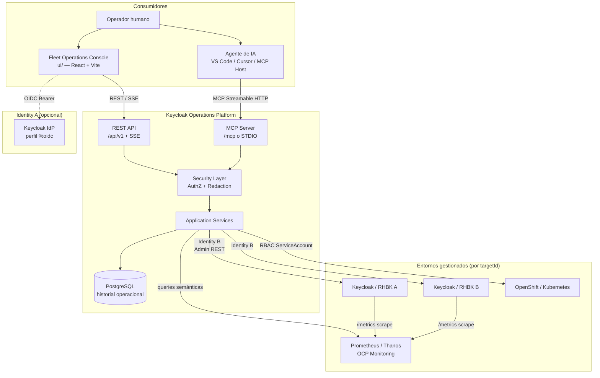
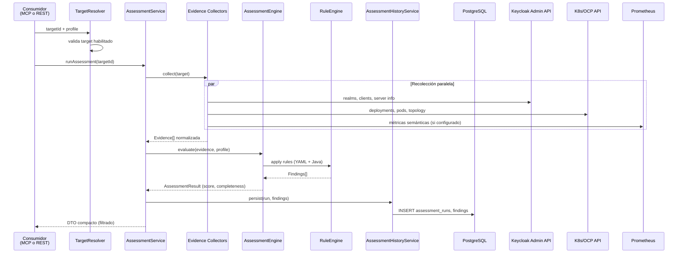
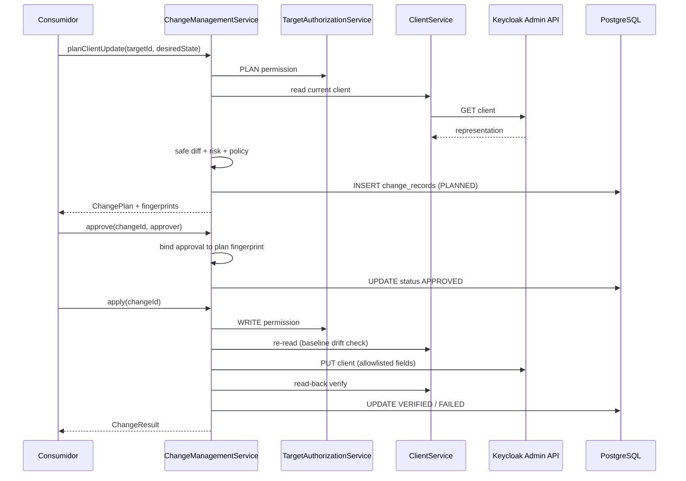
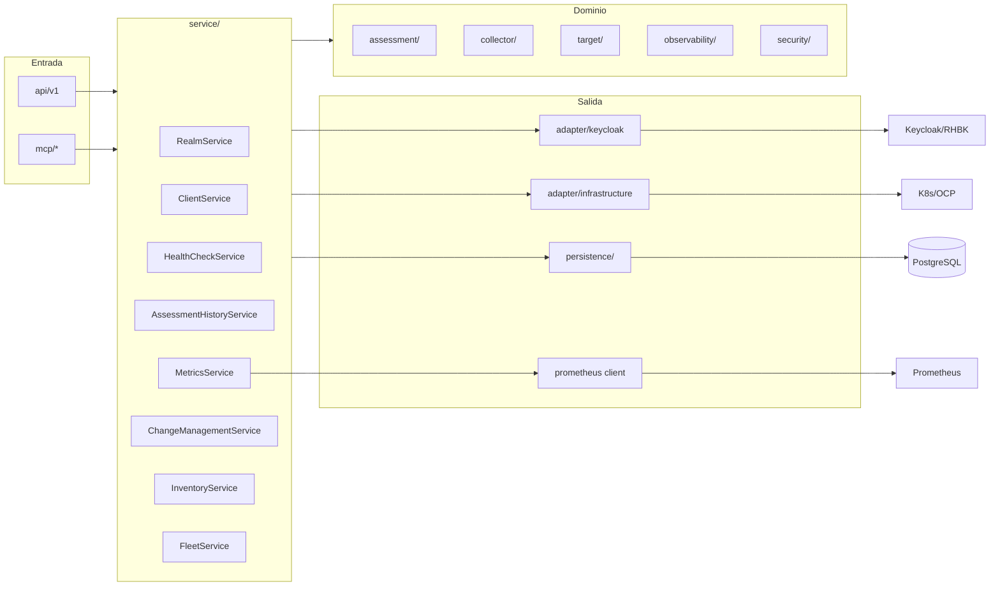
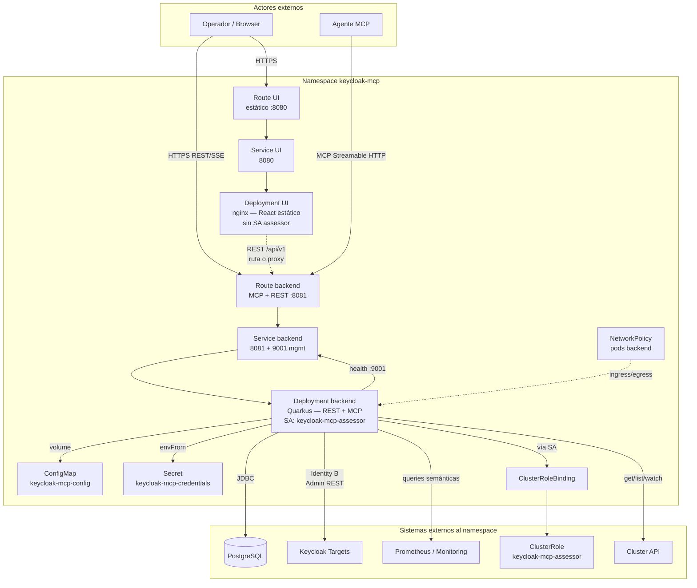

# High-Level Design — Keycloak / RHBK Operations Platform

**Versión:** 0.8.0-SNAPSHOT  
**Artefacto:** `io.github.keycloakmcp:keycloak-operations-mcp`  
**Repositorio:** https://github.com/csfreitas/keycloak-operations

---

## 1. Visión General del Sistema y Objetivos de Negocio

### 1.1 Qué es

La **Keycloak / RHBK Operations Platform** es una plataforma operacional que centraliza administración, diagnóstico, salud operacional, evaluación de preparación para producción y métricas semánticas de entornos [Keycloak](https://www.keycloak.org/) y [Red Hat build of Keycloak (RHBK)](https://docs.redhat.com/en/documentation/red_hat_build_of_keycloak).

La solución expone dos interfaces de consumo sobre la **misma capa de servicios de aplicación**:

| Interface | Consumidor | Protocolo |
|-----------|------------|-----------|
| **MCP Server** | Agentes de IA (VS Code, Cursor, etc.) | Model Context Protocol — Streamable HTTP (`/mcp`) o STDIO |
| **REST API** | Fleet Operations Console (`ui/`) e integraciones | HTTP JSON `/api/v1` + SSE (`/api/v1/events`) |

El console web y los agentes de IA **nunca** acceden directamente a Keycloak Admin, Kubernetes/OpenShift, Prometheus o PostgreSQL. Toda interacción pasa por el backend, que aplica aislamiento por target, redacción de datos sensibles, auditoría y políticas determinísticas.

### 1.2 Problema de negocio

Operadores y equipos de plataforma necesitan responder, de forma repetible y auditable, preguntas como:

- ¿Cuál es el estado de salud y la postura de HA de mis entornos Keycloak/RHBK?
- ¿Existen misconfiguraciones de seguridad o producción en realms, clients, usuarios o infraestructura?
- ¿Cómo está el rendimiento (latencia, errores, pools, JVM) en cada entorno?
- ¿Cómo aplicar cambios administrativos de forma controlada, con aprobación y verificación?

En organizaciones con **múltiples entornos** (DEV, HML, PRD), la plataforma ofrece un punto de control unificado con aislamiento por `targetId`, evitando que agentes de IA u operadores proporcionen URLs arbitrarias (mitigación de SSRF).

### 1.3 Objetivos de negocio

| Objetivo | Cómo la plataforma lo atiende |
|----------|-------------------------------|
| **Operación multi-entorno** | Registro de múltiples targets Keycloak/RHBK con credenciales y endpoints conocidos |
| **Diagnóstico estructurado** | Health checks operacionales independientes de assessments de preparación |
| **Evaluación determinística** | Motor Evidence → Rules → Findings; LLM no decide PASS/FAIL |
| **Observabilidad semántica** | Métricas vía catálogo semántico; sin PromQL expuesto a clientes |
| **Administración controlada** | Ciclo plan → approve → apply → verify con fingerprints y políticas por entorno |
| **Auditabilidad** | Eventos de auditoría sanitizados persistidos en PostgreSQL |
| **Experiencia híbrida humano + IA** | Console web para operadores; MCP para agentes asistidos por LLM |

### 1.4 Alcance actual (milestone 0.8)

**Implementado:**

- Lectura administrativa Keycloak/RHBK (realms, clients, users, groups, roles, server info)
- Inventario de infraestructura OpenShift/Kubernetes (target-aware)
- Motor de assessment con perfiles y rule packs YAML
- Health checks con historial persistido
- Métricas semánticas (Prometheus, Thanos, OpenShift Monitoring)
- Persistencia Flyway V1–V7 (targets, assessments, health, audit, snapshots, changes)
- Fleet Operations Console (React)
- Administración controlada — POC de actualización de client no sensible

**Fuera de alcance / limitaciones conocidas:**

- Administración completa de realm/client/user/flow/IdP (milestones 0.8.1–0.8.4)
- Operaciones destructivas, workflows de contraseña/secreto
- SSE multi-réplica (fan-out in-process)
- Inventario VM
- Multi-tenancy de operadores (futuro)

---

## 2. Arquitectura de Alto Nivel

### 2.1 Principios arquitectónicos

1. **Multi-target by design** — toda operación identifica un `targetId` registrado; las URLs nunca vienen del cliente/LLM ([ADR 0001](../../../adr/0001-multi-target-by-design.md), [ADR 0004](../../../adr/0004-no-arbitrary-endpoints-from-mcp.md)).
2. **MCP y REST comparten servicios** — controllers y tools son fachadas delgadas; la lógica vive en `service/`.
3. **Admin REST como frontera** — integración Keycloak vía Admin REST estable, no APIs internas ([ADR 0002](../../../adr/0002-admin-rest-as-keycloak-integration-boundary.md)).
4. **Assessment determinístico** — Evidence → Rules → Findings; scoring y políticas son código/YAML ([ADR 0003](../../../adr/0003-deterministic-assessment-engine.md)).
5. **PostgreSQL no es TSDB** — historial operacional en PG; series temporales en Prometheus ([ADR 0005](../../../adr/0005-postgresql-is-not-a-tsdb.md)).
6. **Métricas semánticas** — sin PromQL expuesto; queries bound al target ([ADR 0006](../../../adr/0006-semantic-metrics-instead-of-raw-promql.md)).
7. **Cambios controlados** — plan/approve/apply/verify; LLM no decide riesgo ni aprobación ([ADR 0007](../../../adr/0007-plan-approve-apply-change-model.md)).
8. **Read-only por defecto** — `mcp.read-only=true`; writes exigen opt-out explícito + permiso WRITE.

### 2.2 Capas lógicas

```text
┌─────────────────────────────────────────────────────────────────────────┐
│  Consumidores                                                            │
│  ┌──────────────────┐  ┌──────────────────┐  ┌──────────────────────┐ │
│  │ Fleet Console    │  │ Agentes MCP      │  │ Integraciones REST     │ │
│  │ (ui/ — React)    │  │ (VS Code/Cursor) │  │ (futuro)             │ │
│  └────────┬─────────┘  └────────┬─────────┘  └──────────┬───────────┘ │
└───────────┼─────────────────────┼────────────────────────┼──────────────┘
            │ REST/SSE            │ MCP HTTP/STDIO         │ REST
┌───────────▼─────────────────────▼────────────────────────▼──────────────┐
│  Adaptadores de entrada (fachada)                                        │
│  api/v1/* (REST)                    mcp/* (@Tool keycloak_*)             │
└───────────┬─────────────────────────────────────────────────────────────┘
            │
┌───────────▼─────────────────────────────────────────────────────────────┐
│  Capa de servicios de aplicación                                         │
│  RealmService, ClientService, AssessmentHistoryService,                    │
│  HealthCheckService, MetricsService, ChangeManagementService,            │
│  InventoryService, FleetService, SnapshotService, AuditQueryService      │
└───────────┬─────────────────────────────────────────────────────────────┘
            │
┌───────────▼─────────────────────────────────────────────────────────────┐
│  Dominio transversal                                                       │
│  target/ (registry, resolver)  security/ (redaction, authz)             │
│  assessment/ (engine, profiles)  collector/ (evidence)                   │
│  observability/ (metrics providers)  audit/  credential/                  │
└───────────┬─────────────────────────────────────────────────────────────┘
            │
┌───────────▼─────────────────────────────────────────────────────────────┐
│  Adaptadores de salida                                                      │
│  adapter/keycloak/ (Admin Client)  adapter/infrastructure/ (Fabric8)      │
│  observability/metrics/prometheus/  persistence/ (JPA + Flyway)          │
└───────────┬─────────────────────────────────────────────────────────────┘
            │
┌───────────▼─────────────────────────────────────────────────────────────┐
│  Sistemas externos                                                         │
│  Keycloak/RHBK  OpenShift/K8s  Prometheus/Thanos  PostgreSQL              │
└───────────────────────────────────────────────────────────────────────────┘
```

### 2.3 Componentes principales

#### 2.3.1 Backend (`keycloak-operations-mcp`)

| Pacote / módulo | Responsabilidad |
|-----------------|-----------------|
| `api/v1/` | REST controllers versionados (`/api/v1`) — fleet, targets, assessments, health, metrics, inventory, changes, audit, events (SSE) |
| `mcp/` | Herramientas MCP (`keycloak_*`) — fachada delgada sobre servicios |
| `service/` | Orquestación de dominio — admin Keycloak, plataforma, change management |
| `target/` | `TargetRegistry`, `TargetResolver`, configuración multi-target, capabilities |
| `adapter/keycloak/` | `StableAdminApiAdapter`, mappers sin secretos |
| `adapter/infrastructure/` | `InfrastructureClientFactory` — clientes Fabric8 K8s/OCP |
| `collector/` | Recolección de evidence normalizada para assessment |
| `assessment/` | `AssessmentEngine`, `RuleEngine`, perfiles, scoring |
| `observability/` | `MetricsProvider`, factory, queries semánticas, límites |
| `persistence/` | Entidades JPA, repositorios, mappers — historial operacional |
| `security/` | `SensitiveDataFilter`, `TargetAuthorizationService`, gates read-only |
| `credential/` | `ConfigCredentialProvider` — resuelve `credentialRef` |
| `audit/` | `AuditService`, `AuditEventPersister` — logs estructurados sanitizados |
| `discovery/` | Detección de entorno (K8s/OCP/VM) |
| `config/` | `ConfigMapping` — métricas, health, discovery, retención |

#### 2.3.2 Frontend (`ui/` — Fleet Operations Console)

| Área | Responsabilidad |
|------|-----------------|
| `api/` | Cliente HTTP tipado para `/api/v1` |
| `pages/` | Fleet, overview, health, assessment, performance, infrastructure, history, changes |
| `auth/` | `AuthProvider` — OIDC-ready (`VITE_AUTH_MODE`) |
| `hooks/` | `useFleet`, `useTargetOverview`, `useEvents` (SSE) |

Empaquetamiento de producción: imagen nginx estática (`ui/Containerfile`), separada del pod Quarkus.

#### 2.3.3 Persistencia

PostgreSQL con migraciones Flyway:

| Migración | Contenido |
|----------|----------|
| V1 | `targets`, `target_tags` |
| V2 | `assessment_runs`, `assessment_findings` |
| V3 | `health_check_runs`, `health_check_results` |
| V4 | `audit_events` |
| V5 | `environment_snapshots`, `inventory_snapshots` |
| V6 | Columnas de profundidad de assessment + subject en findings |
| V7 | `change_records` — ciclo de vida de cambios |

#### 2.3.4 Targets y proveedores externos

Cada **Target** representa un entorno Keycloak/RHBK registrado con:

- `targetId`, tipo, entorno (DEV/TEST/HML/PRD), tags
- Configuración Keycloak (URL, auth-realm, client-id, `credential-ref`)
- Configuración opcional de infraestructura (namespace, cluster)
- Configuración opcional de observabilidad (Prometheus/OCP Monitoring)

Flujo de resolución:

```text
targetId → TargetResolver → TargetRegistry → Target
         → CredentialProvider (Identity B)
         → KeycloakClientFactory / InfrastructureClientFactory / MetricsProviderFactory
```

### 2.4 Flujos funcionales principales

#### 2.4.1 Lectura administrativa (read)

```text
MCP/REST → TargetAuthorizationService (READ)
         → *Service (Realm, Client, User, …)
         → StableAdminApiAdapter → Keycloak Admin REST
         → RepresentationMapper (sin secretos)
         → SensitiveDataFilter → respuesta
         → AuditService (opcional)
```

#### 2.4.2 Assessment

```text
MCP/REST → AssessmentService
         → Collectors (Keycloak, K8s/OCP, Metrics)
         → Evidence[] normalizada
         → AssessmentEngine + RuleEngine (YAML + Java)
         → Findings + Score
         → AssessmentHistoryService → PostgreSQL
         → SensitiveDataFilter → respuesta compacta (sin dump de evidence)
```

Health check es **independiente**: responde "¿está en línea?" vs. assessment que responde "¿está listo para producción?".

#### 2.4.3 Métricas semánticas

```text
MCP/REST → MetricsService
         → MetricsProviderFactory (target-bound)
         → PrometheusApiClient / OpenShift Monitoring
         → SemanticMetricResult (catálogo predefinido)
         → REST/MCP + MetricsEvidenceCollector → Assessment
```

#### 2.4.4 Administración controlada (write)

```text
MCP/REST → ChangeManagementService.plan()
         → lectura estado actual → diff seguro → riesgo → política por entorno
         → ChangePlan (fingerprints)
         → approve (bound al fingerprint)
         → apply (Admin REST; stale-plan protection)
         → verify (read-back)
         → change_records + audit
```

#### 2.4.5 Fleet Console

```text
Browser → nginx (ui/) → REST /api/v1
       → FleetService / TargetOverviewService / …
       → PostgreSQL (historial) + live calls (Keycloak/metrics/K8s)
SSE: GET /api/v1/events — eventos in-process (assessment/health completed)
```

### 2.5 Modelo de identidad (dos identidades)

| Identidad | Dirección | Propósito |
|-----------|-----------|-----------|
| **Identity A** | Operador → Plataforma | OIDC en REST/UI (`%oidc` profile); default lab = OPEN_LAB |
| **Identity B** | Plataforma → Target Keycloak | `credentialRef` vía `CredentialProvider`; nunca expuesto a UI/LLM |

Regla: nunca mezclar tokens Identity A en clientes Admin del target.

### 2.6 Deployment

| Entorno | Componentes |
|---------|-------------|
| **Local (dev)** | `podman compose` — PostgreSQL, Keycloak(s), Prometheus; Quarkus `:8081`; Vite `:5173` |
| **OpenShift** | Manifests en `deploy/openshift/` — backend (ServiceAccount + ClusterRole), UI nginx, Routes, NetworkPolicy, Secrets |
| **Kubernetes** | `deploy/kubernetes/deployment.yaml` |

Puertos predeterminados:

- Aplicación HTTP: `8081` (REST + MCP)
- Management: `9001` (`/q/health`, `/q/metrics`, OpenAPI)

---

## 3. Diagramas de Arquitectura (Mermaid)

### 3.1 Vista de contexto — actores y sistemas



### 3.2 Flujo de datos — assessment end-to-end



### 3.3 Flujo de datos — change management



### 3.4 Arquitectura interna del backend — paquetes



### 3.5 Deployment OpenShift (vista lógica)

Vista lógica alineada con los manifests en `deploy/openshift/`. El namespace real es `keycloak-mcp` (no `kc-ops`). La `NetworkPolicy` aplica solo a los pods del backend; el pod de UI no monta el ServiceAccount assessor.



**Componentes y flujos no representados en el diagrama anterior:**

| Elemento | Rol |
|----------|-----|
| `ClusterRole` + `ClusterRoleBinding` | Otorgan al ServiceAccount `keycloak-mcp-assessor` permisos de inventario en el cluster |
| Puerto `9001` (management) | `/q/health`, `/q/metrics` y OpenAPI — expuesto por el Service backend, no por la Route pública por defecto |
| Réplicas | Backend y UI con `replicas: 2` en los manifests actuales |
| UI aislada | `automountServiceAccountToken: false` — sin credenciales de cluster en el pod nginx |
| Identity A (opcional) | El browser se autentica vía OIDC (`%oidc`) antes de llamar `/api/v1/*` |

---

## 4. Tecnologías y Bibliotecas Utilizadas

### 4.1 Backend (Java / Quarkus)

| Tecnología | Versión | Uso |
|------------|--------|-----|
| **Java** | 21 | Runtime |
| **Quarkus** | 3.38.1 | Framework cloud-native, DI (Arc), REST, config |
| **Quarkiverse MCP Server** | 1.13.1 | Servidor MCP (HTTP Streamable + profile STDIO) |
| **Keycloak Admin Client** | 26.0.12 | Integración Admin REST estable |
| **Hibernate ORM Panache** | (BOM Quarkus) | Persistencia JPA |
| **Flyway** | (BOM Quarkus) | Migraciones de schema |
| **PostgreSQL JDBC** | (BOM Quarkus) | Driver de base de datos |
| **Fabric8 Kubernetes Client** | (BOM Quarkus) | Inventario K8s/OCP |
| **Fabric8 OpenShift Client** | (BOM Quarkus) | APIs OpenShift |
| **SnakeYAML** | 2.4 | Rule packs de assessment |
| **SmallRye Health** | (BOM Quarkus) | Health checks de la plataforma |
| **Micrometer + Prometheus** | (BOM Quarkus) | Métricas de la plataforma (`/q/metrics`) |
| **OpenTelemetry** | (BOM Quarkus) | Tracing distribuido |
| **SmallRye Fault Tolerance** | (BOM Quarkus) | Resiliencia (timeouts, circuit breaker) |
| **Quarkus OIDC** | (BOM Quarkus) | Identity A (perfil `%oidc`) |
| **SmallRye OpenAPI** | (BOM Quarkus) | Documentación REST (`/q/openapi`) |
| **Hibernate Validator** | (BOM Quarkus) | Validación de entrada |
| **Quarkus Scheduler** | (BOM Quarkus) | Jobs programados (retención — futuro) |

**Build:** Maven 3.x, `quarkus-maven-plugin`, profiles `stdio` y `native`.

### 4.2 Frontend (`ui/`)

| Tecnología | Versión | Uso |
|------------|--------|-----|
| **Node.js** | ≥ 20 | Runtime de build |
| **React** | 18.3.x | UI components |
| **React Router** | 6.28.x | Ruteo SPA |
| **TypeScript** | 5.6.x | Tipado estático |
| **Vite** | 5.4.x | Bundler y dev server |
| **Vitest** | 2.1.x | Pruebas unitarias |
| **Testing Library** | 16.x | Pruebas de componentes |

**Deploy UI:** nginx (Containerfile), manifests OpenShift `100-ui-*.yaml`.

### 4.3 Infraestructura y datos

| Componente | Versión (lab) | Uso |
|------------|--------------|-----|
| **PostgreSQL** | 16 | Historial operacional |
| **Keycloak** | 26.7.1 (compose) | Targets de demostración |
| **Prometheus** | v2.55.1 (compose) | Métricas de target |
| **Podman Compose** | — | Entorno local (`dev/compose.yaml`) |

### 4.4 Pruebas

| Herramienta | Uso |
|------------|-----|
| JUnit 5 + Quarkus Test | Pruebas unitarias y de integración |
| AssertJ, Mockito | Aserciones y mocks |
| Rest Assured | Pruebas REST |
| Testcontainers (PostgreSQL) | Pruebas con base de datos real |
| Fabric8 Kubernetes Server Mock | Pruebas de inventario K8s |
| Vitest + jsdom | Pruebas frontend (50 pruebas) |

### 4.5 Herramientas MCP expuestas (catálogo resumido)

| Grupo | Ejemplos |
|-------|----------|
| Targets | `keycloak_list_targets`, `keycloak_get_target`, `keycloak_find_targets` |
| Admin read | `keycloak_list/get_realm`, `keycloak_list/get_client`, users, groups, roles |
| Discovery | `keycloak_discover_environment`, `keycloak_get_inventory` |
| Assessment | `keycloak_run_assessment`, `keycloak_get_assessment`, `keycloak_get_findings` |
| Health | `keycloak_health_check` |
| Metrics | `keycloak_get_metrics`, `keycloak_get_metrics_status`, `keycloak_get_performance_summary` |
| Changes | `keycloak_plan_client_update`, `keycloak_approve/reject/apply/verify_change` |
| Server | `keycloak_server_info` |

---

## 5. Consideraciones de Seguridad, Escalabilidad y Almacenamiento

### 5.1 Seguridad

#### 5.1.1 Principios implementados en el código

| Control | Implementación |
|----------|---------------|
| **Read-only default** | `mcp.read-only=true`; tools de write no registradas sin opt-out |
| **Sin secretos en respuestas** | `ClientDetails` sin campos de secret; `RepresentationMapper` no copia credenciales |
| **Redacción en profundidad** | `SensitiveDataFilter` — claves `password`, `secret`, `token`, `credential`, etc. |
| **Sin secretos en logs** | Audit y logging pasan por redacción antes de persistir/loguear |
| **Aislamiento por target** | `TargetResolver` rechaza IDs desconocidos; queries PG filtran por `target_id` |
| **Anti-SSRF** | URLs de Keycloak, K8s y Prometheus vienen solo del registro de target |
| **Autorización por target** | `TargetAuthorizationService` — READ, ASSESS, PLAN, WRITE, ADMIN |
| **Política por entorno** | PRD exige aprobación; DELETE denegado en 0.8 |
| **Integridad de cambios** | Plan fingerprint + baseline fingerprint; detección de drift |
| **Menor privilegio (producción)** | Service accounts con `view-*` / FGAP; no `realm-admin` |

#### 5.1.2 Credenciales

- **Identity B:** almacenadas en `mcp.credentials.*` (config/env); targets referencian vía `credential-ref`.
- PostgreSQL guarda solo `keycloak_credential_ref`, nunca secretos en plaintext.
- Templates OpenShift (`deploy/openshift/50-secret.yaml`) usan placeholders — sin secretos reales en git.

#### 5.1.3 Hardening de deployment

Manifests OpenShift definen:

- `runAsNonRoot: true`
- `readOnlyRootFilesystem: true`
- `allowPrivilegeEscalation: false`
- drop all capabilities
- `NetworkPolicy` limitando ingress/egress

UI en pod separado **sin** ServiceAccount de assessor — el backend permanece como frontera de seguridad.

#### 5.1.4 RBAC Kubernetes

`ClusterRole` del assessor incluye `get/list/watch` en Secrets para correlacionar metadatos. Valores de Secret pasan por `SensitiveDataFilter`. Preferir Roles namespace-scoped cuando sea posible.

#### 5.1.5 Autenticación REST (Identity A)

- Default lab: `OPEN_LAB` — `/api/v1/me` reporta `authMode=OPEN_LAB`.
- Producción: perfil Quarkus `%oidc` — `/api/v1/*` exige autenticación; `/mcp` y `/q/*` permanecen públicos (configurable).

### 5.2 Escalabilidad

#### 5.2.1 Modelo de deployment actual

- **Recomendado:** instancia centralizada del backend con conectividad de red a todos los targets.
- Backend stateless para operaciones de lectura; estado en PostgreSQL.
- `KeycloakClientFactory` cachea clientes Admin por `targetId` con fingerprint de credenciales.

#### 5.2.2 Limitaciones y consideraciones

| Aspecto | Estado actual | Implicación |
|---------|--------------|------------|
| **SSE** | In-process (`EventsResource`) | Multi-réplica requiere sticky sessions o broker externo (futuro) |
| **Cache de métricas** | TTL configurable (`metrics.availability-cache-ttl-seconds`) | Reduce carga al Prometheus |
| **Límites de queries** | `metrics.max-range`, `max-series`, `max-points` | Protege contra queries explosivas |
| **Límites de assessment** | `assessment.max-realms`, `max-clients-per-realm` | Limita recolección en entornos grandes |
| **Timeouts** | health/metrics connect + read timeouts | Falla controlada (NFR-RES-003) |
| **Fault Tolerance** | SmallRye FT en el classpath | Disponible para llamadas remotas |
| **Native image** | Profile Maven `native` | Opción de startup rápido y menor footprint |

#### 5.2.3 Escalabilidad horizontal (direcciones futuras)

- Réplicas del backend detrás de load balancer para REST/MCP stateless.
- SSE: Redis/NATS para fan-out entre réplicas.
- Edge collectors en sitios air-gapped reportando evidence al MCP central (abstracción Target preservada).
- Instancias separadas por dominio de confianza/regulación.

#### 5.2.4 Degradación graciosa

- Ausencia de Prometheus **no** impide rules estáticas (NFR-RES-001).
- Rules de performance retornan `NOT_EVALUATED` — nunca PASS falso con ceros inventados (NFR-RES-002).
- Falla en un target no derriba el fleet (`FleetService` agrega por target).

### 5.3 Almacenamiento

#### 5.3.1 PostgreSQL — qué almacena

| Dominio | Tablas principales | Retención predeterminada (días) |
|---------|-------------------|---------------------------------|
| Targets | `targets`, `target_tags` | — (config) |
| Assessments | `assessment_runs`, `assessment_findings` | 365 |
| Health | `health_check_runs`, `health_check_results` | 90 |
| Audit | `audit_events` | 90 |
| Snapshots | `environment_snapshots`, `inventory_snapshots` | 180 |
| Changes | `change_records` | — (lifecycle) |

Configuración: `platform.retention.*` en `application.properties`. Job de enforcement documentado como trabajo futuro.

#### 5.3.2 Qué PostgreSQL NO almacena

- Series temporales de métricas (ADR 0005)
- Secretos, contraseñas, client secrets, tokens
- Evidence maps completos en respuestas MCP (solo claves referenciadas)

#### 5.3.3 Prometheus / Thanos — métricas

- Keycloak expone `/metrics`; Prometheus hace scrape.
- La plataforma consulta vía `MetricsProvider` con queries semánticas predefinidas.
- Percentiles HTTP (p50/p95/p99) solo con histogram buckets; de lo contrario `NOT_AVAILABLE`.
- Muestras stale (`metrics.stale-after`) no generan PASS de performance.

#### 5.3.4 Snapshots

- `SnapshotService` captura estado de entorno/inventario para comparación temporal.
- Útil para drift detection entre ejecuciones de assessment.

#### 5.3.5 Migraciones y schema

- Flyway `migrate-at-start=true`
- Hibernate `schema-management.strategy=none` — schema exclusivamente vía Flyway
- Dev: `jdbc:postgresql://localhost:5432/kcops`; pruebas: Dev Services PostgreSQL 16

---

## 6. Referencias

| Documento | Ruta |
|-----------|------|
| Architecture overview | [`docs/architecture/overview.md`](../../overview.md) |
| Multi-target | [`docs/architecture/multi-target.md`](../../multi-target.md) |
| Assessment engine | [`docs/architecture/assessment-engine.md`](../../assessment-engine.md) |
| Security | [`docs/architecture/security.md`](../../security.md) |
| Persistence | [`docs/architecture/persistence.md`](../../persistence.md) |
| Controlled administration | [`docs/architecture/controlled-administration.md`](../../controlled-administration.md) |
| UI architecture | [`docs/ui-architecture.md`](../../ui-architecture.md) |
| Identity model | [`docs/identity-model.md`](../../identity-model.md) |
| REST API | [`docs/rest-api.md`](../../rest-api.md) |
| Database schema | [`docs/database-schema.md`](../../database-schema.md) |
| Project state | [`docs/project-state.md`](../../project-state.md) |

---

*Documento generado a partir del análisis del código fuente y la documentación existente — agosto de 2026.*
