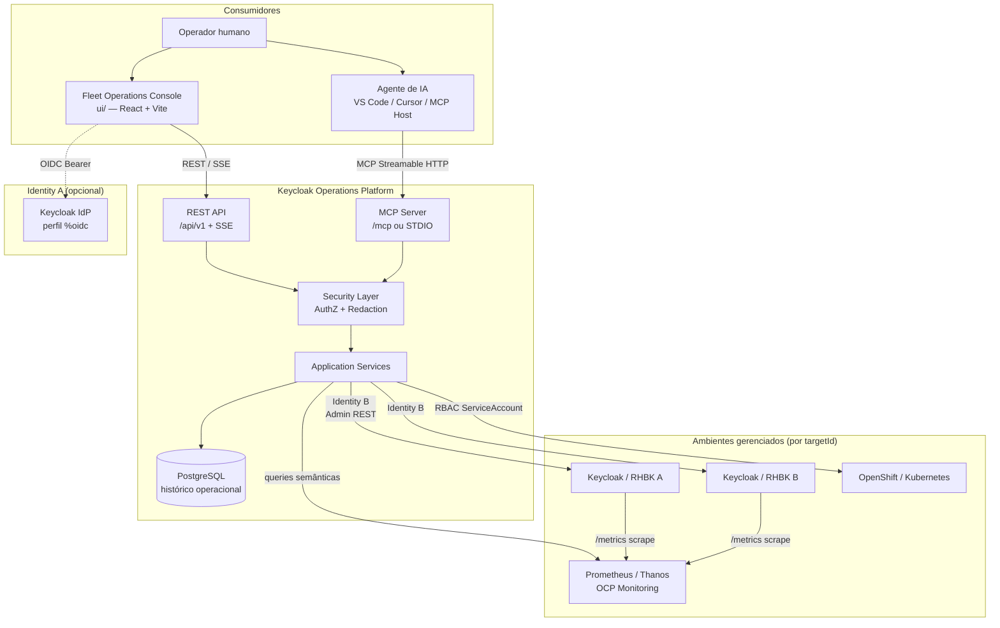
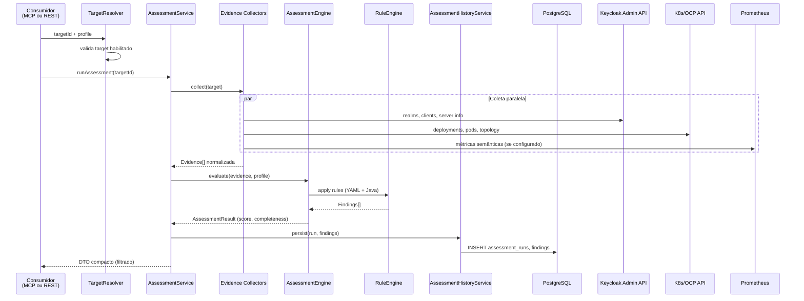
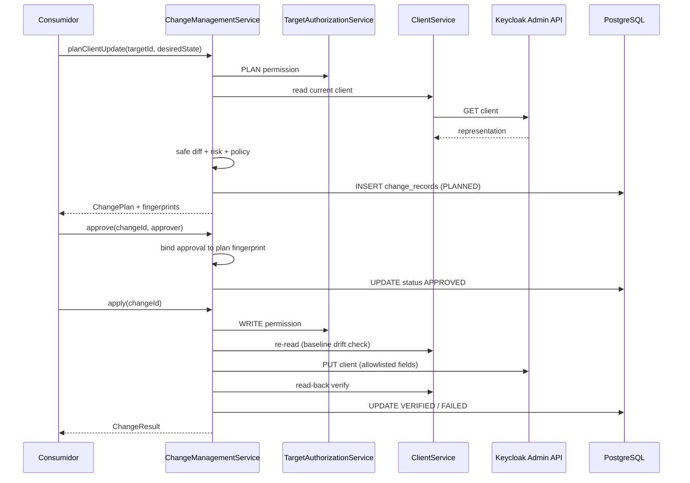
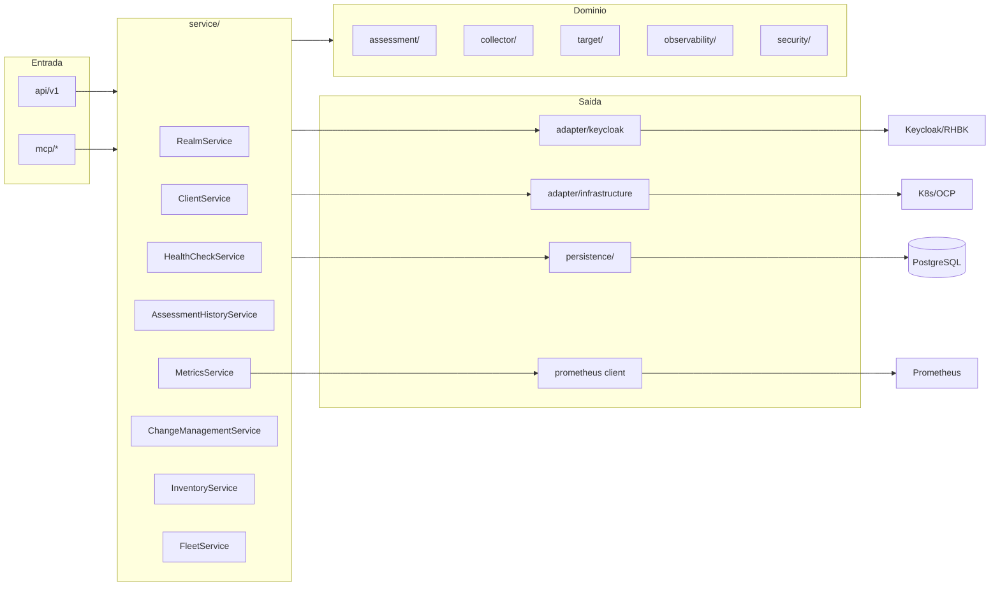
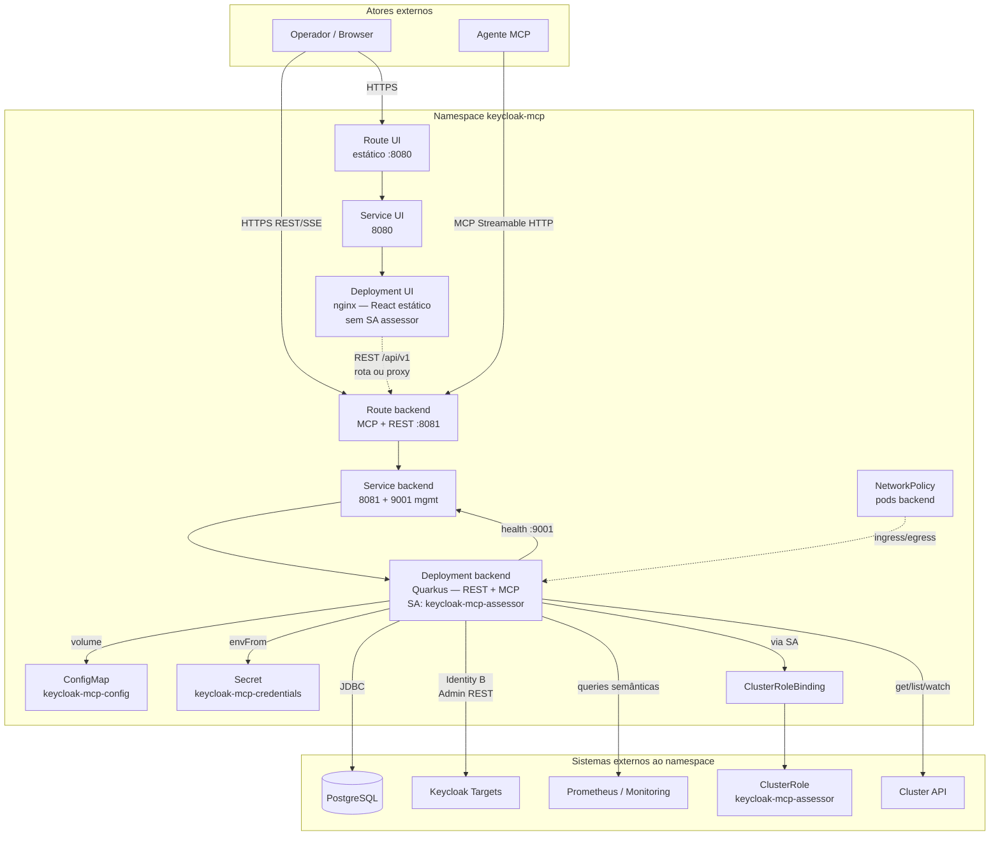

# High-Level Design — Keycloak / RHBK Operations Platform

**Versão:** 0.8.0-SNAPSHOT  
**Artefato:** `io.github.keycloakmcp:keycloak-operations-mcp`  
**Repositório:** https://github.com/csfreitas/keycloak-operations

---

## 1. Visão Geral do Sistema e Objetivos de Negócio

### 1.1 O que é

A **Keycloak / RHBK Operations Platform** é uma plataforma operacional que centraliza administração, diagnóstico, saúde operacional, avaliação de prontidão para produção e métricas semânticas de ambientes [Keycloak](https://www.keycloak.org/) e [Red Hat build of Keycloak (RHBK)](https://docs.redhat.com/en/documentation/red_hat_build_of_keycloak).

A solução expõe duas interfaces de consumo sobre a **mesma camada de serviços de aplicação**:

| Interface | Consumidor | Protocolo |
|-----------|------------|-----------|
| **MCP Server** | Agentes de IA (VS Code, Cursor, etc.) | Model Context Protocol — Streamable HTTP (`/mcp`) ou STDIO |
| **REST API** | Fleet Operations Console (`ui/`) e integrações | HTTP JSON `/api/v1` + SSE (`/api/v1/events`) |

O console web e os agentes de IA **nunca** acessam diretamente Keycloak Admin, Kubernetes/OpenShift, Prometheus ou PostgreSQL. Toda interação passa pelo backend, que aplica isolamento por target, redação de dados sensíveis, auditoria e políticas determinísticas.

### 1.2 Problema de negócio

Operadores e equipes de plataforma precisam responder, de forma repetível e auditável, perguntas como:

- Qual é o estado de saúde e a postura de HA dos meus ambientes Keycloak/RHBK?
- Existem misconfigurações de segurança ou produção em realms, clientes ou infraestrutura?
- Como está a performance (latência, erros, pools, JVM) em cada ambiente?
- Como aplicar mudanças administrativas de forma controlada, com aprovação e verificação?

Em organizações com **múltiplos ambientes** (DEV, HML, PRD), a plataforma oferece um ponto de controle unificado com isolamento por `targetId`, evitando que agentes de IA ou operadores forneçam URLs arbitrárias (mitigação de SSRF).

### 1.3 Objetivos de negócio

| Objetivo | Como a plataforma atende |
|----------|--------------------------|
| **Operação multi-ambiente** | Registro de múltiplos targets Keycloak/RHBK com credenciais e endpoints conhecidos |
| **Diagnóstico estruturado** | Health checks operacionais independentes de assessments de prontidão |
| **Avaliação determinística** | Motor Evidence → Rules → Findings; LLM não decide PASS/FAIL |
| **Observabilidade semântica** | Métricas via catálogo semântico; sem PromQL exposto a clientes |
| **Administração controlada** | Ciclo plan → approve → apply → verify com fingerprints e políticas por ambiente |
| **Auditabilidade** | Eventos de auditoria sanitizados persistidos em PostgreSQL |
| **Experiência híbrida humano + IA** | Console web para operadores; MCP para agentes assistidos por LLM |

### 1.4 Escopo atual (milestone 0.8)

**Implementado:**

- Leitura administrativa Keycloak/RHBK (realms, clients, users, groups, roles, server info)
- Inventário de infraestrutura OpenShift/Kubernetes (target-aware)
- Motor de assessment com perfis e rule packs YAML
- Health checks com histórico persistido
- Métricas semânticas (Prometheus, Thanos, OpenShift Monitoring)
- Persistência Flyway V1–V7 (targets, assessments, health, audit, snapshots, changes)
- Fleet Operations Console (React)
- Administração controlada — POC de atualização de cliente não sensível

**Fora de escopo / limitações conhecidas:**

- Administração completa de realm/client/user/flow/IdP (milestones 0.8.1–0.8.4)
- Operações destrutivas, workflows de senha/segredo
- SSE multi-réplica (fan-out in-process)
- Inventário VM
- Multi-tenancy de operadores (futuro)

---

## 2. Arquitetura de Alto Nível

### 2.1 Princípios arquiteturais

1. **Multi-target by design** — toda operação identifica um `targetId` registrado; URLs nunca vêm do cliente/LLM ([ADR 0001](../../../adr/0001-multi-target-by-design.md), [ADR 0004](../../../adr/0004-no-arbitrary-endpoints-from-mcp.md)).
2. **MCP e REST compartilham serviços** — controllers e tools são fachadas finas; lógica vive em `service/`.
3. **Admin REST como fronteira** — integração Keycloak via Admin REST estável, não APIs internas ([ADR 0002](../../../adr/0002-admin-rest-as-keycloak-integration-boundary.md)).
4. **Assessment determinístico** — Evidence → Rules → Findings; scoring e políticas são código/YAML ([ADR 0003](../../../adr/0003-deterministic-assessment-engine.md)).
5. **PostgreSQL não é TSDB** — histórico operacional em PG; séries temporais em Prometheus ([ADR 0005](../../../adr/0005-postgresql-is-not-a-tsdb.md)).
6. **Métricas semânticas** — sem PromQL exposto; queries bound ao target ([ADR 0006](../../../adr/0006-semantic-metrics-instead-of-raw-promql.md)).
7. **Mudanças controladas** — plan/approve/apply/verify; LLM não decide risco nem aprovação ([ADR 0007](../../../adr/0007-plan-approve-apply-change-model.md)).
8. **Read-only por padrão** — `mcp.read-only=true`; writes exigem opt-out explícito + permissão WRITE.

### 2.2 Camadas lógicas

```text
┌─────────────────────────────────────────────────────────────────────────┐
│  Consumidores                                                            │
│  ┌──────────────────┐  ┌──────────────────┐  ┌──────────────────────┐ │
│  │ Fleet Console    │  │ Agentes MCP      │  │ Integrações REST     │ │
│  │ (ui/ — React)    │  │ (VS Code/Cursor) │  │ (futuro)             │ │
│  └────────┬─────────┘  └────────┬─────────┘  └──────────┬───────────┘ │
└───────────┼─────────────────────┼────────────────────────┼──────────────┘
            │ REST/SSE            │ MCP HTTP/STDIO         │ REST
┌───────────▼─────────────────────▼────────────────────────▼──────────────┐
│  Adaptadores de entrada (fachada)                                        │
│  api/v1/* (REST)                    mcp/* (@Tool keycloak_*)             │
└───────────┬─────────────────────────────────────────────────────────────┘
            │
┌───────────▼─────────────────────────────────────────────────────────────┐
│  Camada de serviços de aplicação                                         │
│  RealmService, ClientService, AssessmentHistoryService,                    │
│  HealthCheckService, MetricsService, ChangeManagementService,            │
│  InventoryService, FleetService, SnapshotService, AuditQueryService      │
└───────────┬─────────────────────────────────────────────────────────────┘
            │
┌───────────▼─────────────────────────────────────────────────────────────┐
│  Domínio transversal                                                       │
│  target/ (registry, resolver)  security/ (redaction, authz)             │
│  assessment/ (engine, profiles)  collector/ (evidence)                   │
│  observability/ (metrics providers)  audit/  credential/                  │
└───────────┬─────────────────────────────────────────────────────────────┘
            │
┌───────────▼─────────────────────────────────────────────────────────────┐
│  Adaptadores de saída                                                      │
│  adapter/keycloak/ (Admin Client)  adapter/infrastructure/ (Fabric8)      │
│  observability/metrics/prometheus/  persistence/ (JPA + Flyway)          │
└───────────┬─────────────────────────────────────────────────────────────┘
            │
┌───────────▼─────────────────────────────────────────────────────────────┐
│  Sistemas externos                                                         │
│  Keycloak/RHBK  OpenShift/K8s  Prometheus/Thanos  PostgreSQL              │
└───────────────────────────────────────────────────────────────────────────┘
```

### 2.3 Componentes principais

#### 2.3.1 Backend (`keycloak-operations-mcp`)

| Pacote / módulo | Responsabilidade |
|-----------------|------------------|
| `api/v1/` | REST controllers versionados (`/api/v1`) — fleet, targets, assessments, health, metrics, inventory, changes, audit, events (SSE) |
| `mcp/` | Ferramentas MCP (`keycloak_*`) — fachada fina sobre serviços |
| `service/` | Orquestração de domínio — admin Keycloak, plataforma, change management |
| `target/` | `TargetRegistry`, `TargetResolver`, configuração multi-target, capabilities |
| `adapter/keycloak/` | `StableAdminApiAdapter`, mappers sem segredos |
| `adapter/infrastructure/` | `InfrastructureClientFactory` — clientes Fabric8 K8s/OCP |
| `collector/` | Coleta de evidence normalizada para assessment |
| `assessment/` | `AssessmentEngine`, `RuleEngine`, perfis, scoring |
| `observability/` | `MetricsProvider`, factory, queries semânticas, limites |
| `persistence/` | Entidades JPA, repositórios, mappers — histórico operacional |
| `security/` | `SensitiveDataFilter`, `TargetAuthorizationService`, gates read-only |
| `credential/` | `ConfigCredentialProvider` — resolve `credentialRef` |
| `audit/` | `AuditService`, `AuditEventPersister` — logs estruturados sanitizados |
| `discovery/` | Detecção de ambiente (K8s/OCP/VM) |
| `config/` | `ConfigMapping` — métricas, health, discovery, retenção |

#### 2.3.2 Frontend (`ui/` — Fleet Operations Console)

| Área | Responsabilidade |
|------|------------------|
| `api/` | Cliente HTTP tipado para `/api/v1` |
| `pages/` | Fleet, overview, health, assessment, performance, infrastructure, history, changes |
| `auth/` | `AuthProvider` — OIDC-ready (`VITE_AUTH_MODE`) |
| `hooks/` | `useFleet`, `useTargetOverview`, `useEvents` (SSE) |

Empacotamento de produção: imagem nginx estática (`ui/Containerfile`), separada do pod Quarkus.

#### 2.3.3 Persistência

PostgreSQL com migrações Flyway:

| Migração | Conteúdo |
|----------|----------|
| V1 | `targets`, `target_tags` |
| V2 | `assessment_runs`, `assessment_findings` |
| V3 | `health_check_runs`, `health_check_results` |
| V4 | `audit_events` |
| V5 | `environment_snapshots`, `inventory_snapshots` |
| V6 | Colunas de profundidade de assessment + subject em findings |
| V7 | `change_records` — ciclo de vida de mudanças |

#### 2.3.4 Targets e provedores externos

Cada **Target** representa um ambiente Keycloak/RHBK registrado com:

- `targetId`, tipo, ambiente (DEV/TEST/HML/PRD), tags
- Configuração Keycloak (URL, auth-realm, client-id, `credential-ref`)
- Configuração opcional de infraestrutura (namespace, cluster)
- Configuração opcional de observabilidade (Prometheus/OCP Monitoring)

Fluxo de resolução:

```text
targetId → TargetResolver → TargetRegistry → Target
         → CredentialProvider (Identity B)
         → KeycloakClientFactory / InfrastructureClientFactory / MetricsProviderFactory
```

### 2.4 Fluxos funcionais principais

#### 2.4.1 Leitura administrativa (read)

```text
MCP/REST → TargetAuthorizationService (READ)
         → *Service (Realm, Client, User, …)
         → StableAdminApiAdapter → Keycloak Admin REST
         → RepresentationMapper (sem segredos)
         → SensitiveDataFilter → resposta
         → AuditService (opcional)
```

#### 2.4.2 Assessment

```text
MCP/REST → AssessmentService
         → Collectors (Keycloak, K8s/OCP, Metrics)
         → Evidence[] normalizada
         → AssessmentEngine + RuleEngine (YAML + Java)
         → Findings + Score
         → AssessmentHistoryService → PostgreSQL
         → SensitiveDataFilter → resposta compacta (sem dump de evidence)
```

Health check é **independente**: responde "está no ar?" vs. assessment que responde "está pronto para produção?".

#### 2.4.3 Métricas semânticas

```text
MCP/REST → MetricsService
         → MetricsProviderFactory (target-bound)
         → PrometheusApiClient / OpenShift Monitoring
         → SemanticMetricResult (catálogo pré-definido)
         → REST/MCP + MetricsEvidenceCollector → Assessment
```

#### 2.4.4 Administração controlada (write)

```text
MCP/REST → ChangeManagementService.plan()
         → leitura estado atual → diff seguro → risco → política por ambiente
         → ChangePlan (fingerprints)
         → approve (bound ao fingerprint)
         → apply (Admin REST; stale-plan protection)
         → verify (read-back)
         → change_records + audit
```

#### 2.4.5 Fleet Console

```text
Browser → nginx (ui/) → REST /api/v1
       → FleetService / TargetOverviewService / …
       → PostgreSQL (histórico) + live calls (Keycloak/metrics/K8s)
SSE: GET /api/v1/events — eventos in-process (assessment/health completed)
```

### 2.5 Modelo de identidade (duas identidades)

| Identidade | Direção | Propósito |
|------------|---------|-----------|
| **Identity A** | Operador → Plataforma | OIDC no REST/UI (`%oidc` profile); default lab = OPEN_LAB |
| **Identity B** | Plataforma → Target Keycloak | `credentialRef` via `CredentialProvider`; nunca exposto à UI/LLM |

Regra: nunca misturar tokens Identity A em clientes Admin do target.

### 2.6 Deployment

| Ambiente | Componentes |
|----------|-------------|
| **Local (dev)** | `podman compose` — PostgreSQL, Keycloak(s), Prometheus; Quarkus `:8081`; Vite `:5173` |
| **OpenShift** | Manifests em `deploy/openshift/` — backend (ServiceAccount + ClusterRole), UI nginx, Routes, NetworkPolicy, Secrets |
| **Kubernetes** | `deploy/kubernetes/deployment.yaml` |

Portas padrão:

- Aplicação HTTP: `8081` (REST + MCP)
- Management: `9001` (`/q/health`, `/q/metrics`, OpenAPI)

---

## 3. Diagramas de Arquitetura (Mermaid)

### 3.1 Visão de contexto — atores e sistemas



### 3.2 Fluxo de dados — assessment end-to-end



### 3.3 Fluxo de dados — change management



### 3.4 Arquitetura interna do backend — pacotes



### 3.5 Deployment OpenShift (visão lógica)

Visão lógica alinhada aos manifests em `deploy/openshift/`. O namespace real é `keycloak-mcp` (não `kc-ops`). A `NetworkPolicy` aplica-se apenas aos pods do backend; o pod da UI não monta o ServiceAccount assessor.



**Componentes e fluxos não representados no diagrama acima:**

| Elemento | Papel |
|----------|-------|
| `ClusterRole` + `ClusterRoleBinding` | Concedem ao ServiceAccount `keycloak-mcp-assessor` permissões de inventário no cluster |
| Porta `9001` (management) | `/q/health`, `/q/metrics` e OpenAPI — exposta pelo Service backend, não pela Route pública por padrão |
| Réplicas | Backend e UI com `replicas: 2` nos manifests atuais |
| UI isolada | `automountServiceAccountToken: false` — sem credenciais de cluster no pod nginx |
| Identity A (opcional) | Browser autentica via OIDC (`%oidc`) antes de chamar `/api/v1/*` |

---

## 4. Tecnologias e Bibliotecas Utilizadas

### 4.1 Backend (Java / Quarkus)

| Tecnologia | Versão | Uso |
|------------|--------|-----|
| **Java** | 21 | Runtime |
| **Quarkus** | 3.38.1 | Framework cloud-native, DI (Arc), REST, config |
| **Quarkiverse MCP Server** | 1.13.1 | Servidor MCP (HTTP Streamable + profile STDIO) |
| **Keycloak Admin Client** | 26.0.12 | Integração Admin REST estável |
| **Hibernate ORM Panache** | (BOM Quarkus) | Persistência JPA |
| **Flyway** | (BOM Quarkus) | Migrações de schema |
| **PostgreSQL JDBC** | (BOM Quarkus) | Driver de banco |
| **Fabric8 Kubernetes Client** | (BOM Quarkus) | Inventário K8s/OCP |
| **Fabric8 OpenShift Client** | (BOM Quarkus) | APIs OpenShift |
| **SnakeYAML** | 2.4 | Rule packs de assessment |
| **SmallRye Health** | (BOM Quarkus) | Health checks da plataforma |
| **Micrometer + Prometheus** | (BOM Quarkus) | Métricas da plataforma (`/q/metrics`) |
| **OpenTelemetry** | (BOM Quarkus) | Tracing distribuído |
| **SmallRye Fault Tolerance** | (BOM Quarkus) | Resiliência (timeouts, circuit breaker) |
| **Quarkus OIDC** | (BOM Quarkus) | Identity A (perfil `%oidc`) |
| **SmallRye OpenAPI** | (BOM Quarkus) | Documentação REST (`/q/openapi`) |
| **Hibernate Validator** | (BOM Quarkus) | Validação de entrada |
| **Quarkus Scheduler** | (BOM Quarkus) | Jobs agendados (retenção — futuro) |

**Build:** Maven 3.x, `quarkus-maven-plugin`, profiles `stdio` e `native`.

### 4.2 Frontend (`ui/`)

| Tecnologia | Versão | Uso |
|------------|--------|-----|
| **Node.js** | ≥ 20 | Runtime de build |
| **React** | 18.3.x | UI components |
| **React Router** | 6.28.x | Roteamento SPA |
| **TypeScript** | 5.6.x | Tipagem estática |
| **Vite** | 5.4.x | Bundler e dev server |
| **Vitest** | 2.1.x | Testes unitários |
| **Testing Library** | 16.x | Testes de componentes |

**Deploy UI:** nginx (Containerfile), manifests OpenShift `100-ui-*.yaml`.

### 4.3 Infraestrutura e dados

| Componente | Versão (lab) | Uso |
|------------|--------------|-----|
| **PostgreSQL** | 16 | Histórico operacional |
| **Keycloak** | 26.7.1 (compose) | Targets de demonstração |
| **Prometheus** | v2.55.1 (compose) | Métricas de target |
| **Podman Compose** | — | Ambiente local (`dev/compose.yaml`) |

### 4.4 Testes

| Ferramenta | Uso |
|------------|-----|
| JUnit 5 + Quarkus Test | Testes unitários e de integração |
| AssertJ, Mockito | Asserções e mocks |
| Rest Assured | Testes REST |
| Testcontainers (PostgreSQL) | Testes com banco real |
| Fabric8 Kubernetes Server Mock | Testes de inventário K8s |
| Vitest + jsdom | Testes frontend (50 testes) |

### 4.5 Ferramentas MCP expostas (catálogo resumido)

| Grupo | Exemplos |
|-------|----------|
| Targets | `keycloak_list_targets`, `keycloak_get_target`, `keycloak_find_targets` |
| Admin read | `keycloak_list/get_realm`, `keycloak_list/get_client`, users, groups, roles |
| Discovery | `keycloak_discover_environment`, `keycloak_get_inventory` |
| Assessment | `keycloak_run_assessment`, `keycloak_get_assessment`, `keycloak_get_findings` |
| Health | `keycloak_health_check` |
| Metrics | `keycloak_get_metrics`, `keycloak_get_metrics_status`, `keycloak_get_performance_summary` |
| Changes | `keycloak_plan_client_update`, `keycloak_approve/reject/apply/verify_change` |
| Server | `keycloak_server_info` |

---

## 5. Considerações de Segurança, Escalabilidade e Armazenamento

### 5.1 Segurança

#### 5.1.1 Princípios implementados no código

| Controle | Implementação |
|----------|---------------|
| **Read-only default** | `mcp.read-only=true`; tools de write não registradas sem opt-out |
| **Sem segredos em respostas** | `ClientDetails` sem campos de secret; `RepresentationMapper` não copia credenciais |
| **Redação em profundidade** | `SensitiveDataFilter` — chaves `password`, `secret`, `token`, `credential`, etc. |
| **Sem segredos em logs** | Audit e logging passam por redação antes de persistir/logar |
| **Isolamento por target** | `TargetResolver` rejeita IDs desconhecidos; queries PG filtram por `target_id` |
| **Anti-SSRF** | URLs de Keycloak, K8s e Prometheus vêm apenas do registro de target |
| **Autorização por target** | `TargetAuthorizationService` — READ, ASSESS, PLAN, WRITE, ADMIN |
| **Política por ambiente** | PRD exige aprovação; DELETE negado em 0.8 |
| **Integridade de mudanças** | Plan fingerprint + baseline fingerprint; detecção de drift |
| **Menor privilégio (produção)** | Service accounts com `view-*` / FGAP; não `realm-admin` |

#### 5.1.2 Credenciais

- **Identity B:** armazenadas em `mcp.credentials.*` (config/env); targets referenciam via `credential-ref`.
- PostgreSQL guarda apenas `keycloak_credential_ref`, nunca segredos em plaintext.
- Templates OpenShift (`deploy/openshift/50-secret.yaml`) usam placeholders — sem segredos reais no git.

#### 5.1.3 Hardening de deployment

Manifests OpenShift definem:

- `runAsNonRoot: true`
- `readOnlyRootFilesystem: true`
- `allowPrivilegeEscalation: false`
- drop all capabilities
- `NetworkPolicy` limitando ingress/egress

UI em pod separado **sem** ServiceAccount de assessor — backend permanece como fronteira de segurança.

#### 5.1.4 RBAC Kubernetes

`ClusterRole` do assessor inclui `get/list/watch` em Secrets para correlacionar metadados. Valores de Secret passam por `SensitiveDataFilter`. Preferir Roles namespace-scoped quando possível.

#### 5.1.5 Autenticação REST (Identity A)

- Default lab: `OPEN_LAB` — `/api/v1/me` reporta `authMode=OPEN_LAB`.
- Produção: perfil Quarkus `%oidc` — `/api/v1/*` exige autenticação; `/mcp` e `/q/*` permanecem públicos (configurável).

### 5.2 Escalabilidade

#### 5.2.1 Modelo de deployment atual

- **Recomendado:** instância centralizada do backend com conectividade de rede a todos os targets.
- Backend stateless para operações de leitura; estado em PostgreSQL.
- `KeycloakClientFactory` cacheia clientes Admin por `targetId` com fingerprint de credenciais.

#### 5.2.2 Limitações e considerações

| Aspecto | Estado atual | Implicação |
|---------|--------------|------------|
| **SSE** | In-process (`EventsResource`) | Multi-réplica requer sticky sessions ou broker externo (futuro) |
| **Cache de métricas** | TTL configurável (`metrics.availability-cache-ttl-seconds`) | Reduz carga ao Prometheus |
| **Bounds de queries** | `metrics.max-range`, `max-series`, `max-points` | Protege contra queries explosivas |
| **Assessment bounds** | `assessment.max-realms`, `max-clients-per-realm` | Limita coleta em ambientes grandes |
| **Timeouts** | health/metrics connect + read timeouts | Falha controlada (NFR-RES-003) |
| **Fault Tolerance** | SmallRye FT no classpath | Disponível para chamadas remotas |
| **Native image** | Profile Maven `native` | Opção de startup rápido e menor footprint |

#### 5.2.3 Escalabilidade horizontal (direções futuras)

- Réplicas do backend atrás de load balancer para REST/MCP stateless.
- SSE: Redis/NATS para fan-out entre réplicas.
- Edge collectors em sites air-gapped reportando evidence ao MCP central (abstração Target preservada).
- Instâncias separadas por domínio de confiança/regulação.

#### 5.2.4 Degradação graciosa

- Ausência de Prometheus **não** impede rules estáticas (NFR-RES-001).
- Rules de performance retornam `NOT_EVALUATED` — nunca PASS falso com zeros inventados (NFR-RES-002).
- Falha em um target não derruba o fleet (`FleetService` agrega por target).

### 5.3 Armazenamento

#### 5.3.1 PostgreSQL — o que armazena

| Domínio | Tabelas principais | Retenção default (dias) |
|---------|-------------------|-------------------------|
| Targets | `targets`, `target_tags` | — (config) |
| Assessments | `assessment_runs`, `assessment_findings` | 365 |
| Health | `health_check_runs`, `health_check_results` | 90 |
| Audit | `audit_events` | 90 |
| Snapshots | `environment_snapshots`, `inventory_snapshots` | 180 |
| Changes | `change_records` | — (lifecycle) |

Configuração: `platform.retention.*` em `application.properties`. Job de enforcement documentado como trabalho futuro.

#### 5.3.2 O que PostgreSQL NÃO armazena

- Séries temporais de métricas (ADR 0005)
- Segredos, senhas, client secrets, tokens
- Evidence maps completos em respostas MCP (apenas chaves referenciadas)

#### 5.3.3 Prometheus / Thanos — métricas

- Keycloak expõe `/metrics`; Prometheus faz scrape.
- Plataforma consulta via `MetricsProvider` com queries semânticas pré-definidas.
- Percentis HTTP (p50/p95/p99) apenas com histogram buckets; caso contrário `NOT_AVAILABLE`.
- Amostras stale (`metrics.stale-after`) não geram PASS de performance.

#### 5.3.4 Snapshots

- `SnapshotService` captura estado de ambiente/inventário para comparação temporal.
- Útil para drift detection entre execuções de assessment.

#### 5.3.5 Migrações e schema

- Flyway `migrate-at-start=true`
- Hibernate `schema-management.strategy=none` — schema exclusivamente via Flyway
- Dev: `jdbc:postgresql://localhost:5432/kcops`; testes: Dev Services PostgreSQL 16

---

## 6. Referências

| Documento | Caminho |
|-----------|---------|
| Architecture overview | [`docs/architecture/overview.md`](../../overview.md) |
| Multi-target | [`docs/architecture/multi-target.md`](../../multi-target.md) |
| Assessment engine | [`docs/architecture/assessment-engine.md`](../../assessment-engine.md) |
| Security | [`docs/architecture/security.md`](../../security.md) |
| Persistence | [`docs/architecture/persistence.md`](../../persistence.md) |
| Controlled administration | [`docs/architecture/controlled-administration.md`](../../controlled-administration.md) |
| UI architecture | [`docs/ui-architecture.md`](../../ui-architecture.md) |
| Identity model | [`docs/identity-model.md`](../../identity-model.md) |
| REST API | [`docs/rest-api.md`](../../rest-api.md) |
| Database schema | [`docs/database-schema.md`](../../database-schema.md) |
| Project state | [`docs/project-state.md`](../../project-state.md) |

---

*Documento gerado com base na análise do código-fonte e documentação existente em agosto de 2026.*
