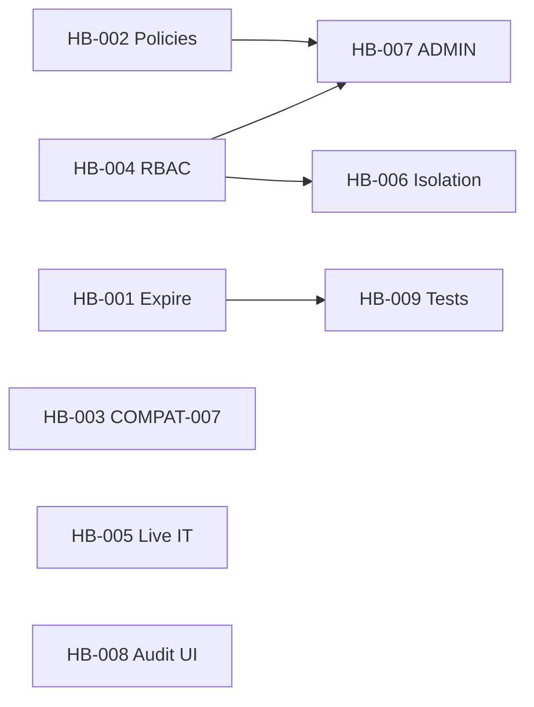

# 0.8.0 Hardening Backlog

Gap-closure work identified after the milestone 0.8 audit. The **foundation is delivered** (plan → approve → apply → verify → audit, client-config POC, MCP/REST/UI), but several spec items remain **partial** or **missing**.

**Goal:** close 0.8 acceptance gaps before expanding administration scope in **0.8.1**.

Related: [0.8 spec](0.8-controlled-administration.md) · [controlled-administration architecture](../architecture/controlled-administration.md) · [project state](../project-state.md)

---

## Priority legend

| Priority | Meaning |
|----------|---------|
| **P0** | Spec gap or security/compliance risk — block 0.8.1 start |
| **P1** | Required for strict 0.8 DoD — should ship in 0.8.0 |
| **P2** | Test/doc/UI polish — can slip only with explicit deferral |
| **P3** | Hygiene / documentation — no functional blocker |

**Size:** S (&lt;1 day) · M (1–3 days) · L (3–5 days)

---

## Summary

| ID | Title | Priority | Size | Status |
|----|-------|----------|------|--------|
| [HB-001](#hb-001-expire-lifecycle) | Expire lifecycle | P0 | M | **ACCEPTED** |
| [HB-002](#hb-002-configurable-environment-policies) | Configurable environment policies | P0 | M | OPEN |
| [HB-003](#hb-003-compat-007-capability-guard-on-writes) | COMPAT-007 capability guard on writes | P0 | M | OPEN |
| [HB-004](#hb-004-fine-grained-rbac) | Fine-grained RBAC (READ/PLAN/WRITE/ADMIN) | P0 | L | OPEN |
| [HB-005](#hb-005-live-integration-test) | Live integration test (plan → verify) | P0 | M | OPEN |
| [HB-006](#hb-006-cross-target-authorization) | Cross-target authorization enforcement | P1 | S | OPEN |
| [HB-007](#hb-007-admin-permission-for-high-risk) | ADMIN permission for high-risk applies | P1 | S | OPEN |
| [HB-008](#hb-008-audit-timeline-ui--api) | Audit timeline (API + UI) | P1 | M | OPEN |
| [HB-009](#hb-009-change-lifecycle-test-coverage) | Change lifecycle test coverage | P1 | M | OPEN |
| [HB-010](#hb-010-secret-leakage-regression-tests) | Secret leakage regression tests | P1 | S | OPEN |
| [HB-011](#hb-011-change-detail-ui-tests) | Change detail UI tests | P2 | S | OPEN |
| [HB-012](#hb-012-rest-change-resource-smoke) | REST change resource smoke expansion | P2 | S | OPEN |
| [HB-013](#hb-013-milestones-readme-consistency) | Milestones README consistency | P3 | S | OPEN |

**0.7 carryover** (separate track): [HB-0.7-001](#hb-0-7-001-oidc-interactive-login) · [HB-0.7-002](#hb-0-7-002-ui-page-test-coverage)

---

## P0 — Block 0.8.1

### HB-001: Expire lifecycle

**Status:** **ACCEPTED** (2026-09-10)

**Spec refs:** milestone 0.8 § Testing (lifecycle: `expire`), § Approval lifecycle (`EXPIRED` state).

**Delivered:**
- `ChangeConfig` — `change.expiration.enabled`, `change.expiration.after` (default `7d`)
- `ChangeExpirationService` — TTL logic, `expireIfNeeded`, `forceExpire`
- `ChangeExpirationScheduler` — hourly batch via `expireStaleChanges()`
- Expire-on-read (`getChange`) and guard on mutations (`requireActiveEntity`)
- REST `POST /api/v1/changes/{id}/expire` · MCP `keycloak_expire_change`
- `McpException.changeExpired()` → HTTP 409

**Acceptance:**
- [x] `WAITING_APPROVAL` / `APPROVED` records transition to `EXPIRED` after TTL
- [x] Apply on expired record returns `CHANGE_EXPIRED`
- [x] Test `expire` in lifecycle suite (spec § Testing)
- [x] `mvn clean verify` green

**Validation evidence (2026-09-10):**

| Check | Method | Result |
|-------|--------|--------|
| AC1 TTL → EXPIRED (`WAITING_APPROVAL`) | Live REST `GET` after Postgres backdate 8d | PASS |
| AC1 TTL → EXPIRED (`APPROVED`) | Live REST `GET` after Postgres backdate 8d | PASS |
| AC2 apply expired → `CHANGE_EXPIRED` | Live REST `POST .../apply` → HTTP 409 | PASS |
| AC2 approve expired → `CHANGE_EXPIRED` | Live REST `POST .../approve` → HTTP 409 | PASS |
| AC3 lifecycle `expire` tests | `ChangeManagementServiceTest` (5) + `ChangeExpirationServiceTest` (3) | PASS — 19 tests, 0 failures |
| AC4 build | `mvn clean verify` | PASS — 161 unit tests |
| Manual expire (`POST /expire`) | `ChangeManagementServiceTest.manualExpireWaitingApproval` | PASS (unit); live REST equivalent to unit path with `MCP_READ_ONLY=false` |

**Files:** `ChangeConfig`, `ChangeExpirationService`, `ChangeExpirationScheduler`, `ChangeManagementService`, `ChangeRepository`, `ChangeResource`, `ChangeTools`, `application.properties`, `ChangeManagementServiceTest`, `ChangeExpirationServiceTest`

---

### HB-002: Configurable environment policies

**Gap:** `ChangePolicyEvaluator` hardcodes DEV/TEST/HML/PRD rules. Spec requires policies to be **configurable**.

**Spec refs:** FR-CHANGE-005, milestone 0.8 § Environment Policies (“Policies must be configurable”), [controlled-administration.md](../architecture/controlled-administration.md) § Environment policy.

**Current state:** `src/main/java/io/github/keycloakmcp/service/change/ChangePolicyEvaluator.java`

**Proposed work:**
1. Introduce `ChangePolicyConfig` (SmallRye Config or YAML) mapping `TargetEnvironment` × `TargetPermission` × `ChangeRisk` → `ALLOW` / `APPROVAL_REQUIRED` / `DENY`.
2. Ship defaults matching current hardcoded behavior (no behavior regression).
3. Document override keys in `application.properties` and architecture doc.
4. Tests: default matrix; custom override changes DEV LOW → APPROVAL_REQUIRED.

**Acceptance:**
- [ ] Policy matrix externalized with documented defaults
- [ ] Operator can override without code change
- [ ] Existing `ChangePolicyAndRiskTest` scenarios still pass
- [ ] Dedicated TEST/HML policy test cases (spec § Policy)

**Files (expected):** `ChangePolicyEvaluator`, new config record, `application.properties`, tests

---

### HB-003: COMPAT-007 capability guard on writes

**Gap:** Version/capability detection exists (`KeycloakVersionDetector`, `KeycloakCapabilities`) but change planning/apply does not fail safely when a mutation is unsupported on the target.

**Spec refs:** COMPAT-007, [compatibility-requirements.md](../requirements/compatibility-requirements.md), milestone 0.8 error model (`UNSUPPORTED_CAPABILITY`).

**Current state:**
- `KeycloakVersionDetector` / `KeycloakCapabilities` in adapter layer
- `ClientConfigChangeSupport.plan()` does not consult capabilities

**Proposed work:**
1. Inject capability snapshot (from target metadata or live `ServerInfo`) into planning path.
2. For client-update POC: validate target supports required Admin API surface; on mismatch throw `UNSUPPORTED_CAPABILITY` with product/version context.
3. Unit test: plan against target stubbed as missing capability → `UNSUPPORTED_CAPABILITY`, no partial plan persisted.

**Acceptance:**
- [ ] Planning fails with `UNSUPPORTED_CAPABILITY` when mutation unavailable
- [ ] No Admin write attempted after capability denial
- [ ] Test covers at least one unsupported scenario

**Files (expected):** `ClientConfigChangeSupport`, `ChangeManagementService`, possibly `TargetCapabilities` integration

---

### HB-004: Fine-grained RBAC

**Gap:** `TargetAuthorizationService` only checks target enabled + global `mcp.read-only`. No per-principal distinction between READ / PLAN / WRITE / ADMIN. Spec requires READ cannot WRITE, PLAN cannot APPLY.

**Spec refs:** FR-CHANGE-007, SEC-CHANGE-004, milestone 0.8 § Authorization Model, § Testing (Authorization).

**Current state:** `src/main/java/io/github/keycloakmcp/target/TargetAuthorizationService.java`

**Proposed work:**
1. Define principal → permission mapping:
   - **OPEN_LAB:** current behavior (all permissions when not read-only) OR explicit role simulation via config.
   - **OIDC (`%oidc`):** map JWT claims / roles to `TargetPermission` set per target (or global role).
2. Enforce in `ChangeManagementService`:
   - `plan` → `PLAN`
   - `approve` / `reject` → `WRITE` or dedicated `APPROVE` (document choice)
   - `apply` → `WRITE` (non-admin) or `ADMIN` (high-risk, see HB-007)
3. MCP `ToolAuthorization` aligned with same service (not duplicate logic).
4. Tests: principal with PLAN only cannot apply; READ cannot plan; WRITE denied when read-only.

**Acceptance:**
- [ ] Distinct principals can be restricted to READ / PLAN / WRITE / ADMIN
- [ ] PLAN without WRITE cannot apply
- [ ] READ cannot plan or apply
- [ ] Works in OPEN_LAB and OIDC profile (at least config-driven mapping)

**Files (expected):** `TargetAuthorizationService`, new `PrincipalAuthorizationService` or OIDC role mapper, `ChangeManagementService`, `ToolAuthorization`, tests

**Depends on:** HB-007 for ADMIN split (can land incrementally: WRITE gate first)

---

### HB-005: Live integration test

**Gap:** `ControlledClientChangeIT` is a placeholder asserting only `RUN_KEYCLOAK_IT=true`.

**Spec refs:** milestone 0.8 § Proof-of-concept mutation (full PLAN→VERIFY), § Acceptance (“at least one semantic Keycloak mutation works end-to-end”).

**Current state:** `src/test/java/io/github/keycloakmcp/it/ControlledClientChangeIT.java`

**Proposed work:**
1. Against Testcontainers Keycloak or lab compose (`dev/compose.yaml`):
   - Create or locate test client
   - `plan` client update (description)
   - `approve` (if PRD policy)
   - `apply`
   - `verify` → `VERIFIED`
2. Guard: `@EnabledIfEnvironmentVariable(RUN_KEYCLOAK_IT=true)`, `mcp.read-only=false`, writable credential ref.
3. Document in `docs/development/integration-tests.md` (or existing IT doc).

**Acceptance:**
- [ ] Opt-in IT exercises full lifecycle on real Keycloak
- [ ] Skipped by default in `mvn clean verify`
- [ ] No secrets in test output or persisted audit

**Files (expected):** `ControlledClientChangeIT`, compose/test fixtures, IT documentation

---

## P1 — Strict 0.8 DoD

### HB-006: Cross-target authorization

**Gap:** Change records are target-scoped, but no test proves get/apply on Target B is denied when principal only has access to Target A.

**Spec refs:** SEC-CHANGE-005, NFR-ISO-001, milestone 0.8 § Multi-target.

**Proposed work:**
1. With HB-004 principal model: user scoped to `target-a` calls `getChange` / `apply` for `target-b` → `targetUnauthorized` or `CHANGE_NOT_FOUND`.
2. Tests in `ChangeManagementServiceTest` or dedicated `ChangeTargetIsolationTest`.

**Acceptance:**
- [ ] Cross-target get denied
- [ ] Cross-target apply denied
- [ ] List changes filtered by authorized targets only

**Depends on:** HB-004 (or minimal target-scoped principal stub)

---

### HB-007: ADMIN permission for high-risk

**Gap:** `TargetPermission.ADMIN` defined but unused. High-risk changes should require ADMIN per architecture doc.

**Spec refs:** milestone 0.8 § Authorization (ADMIN = high-impact applies), architecture § Authorization.

**Proposed work:**
1. `ChangeRiskClassifier`: HIGH (and future CRITICAL) → apply requires `ADMIN` instead of `WRITE`.
2. Policy matrix (HB-002): PRD + HIGH → `ADMIN` + `APPROVAL_REQUIRED`.
3. Tests: WRITE principal cannot apply HIGH-risk; ADMIN can.

**Acceptance:**
- [ ] HIGH-risk apply checks `ADMIN`
- [ ] LOW/MEDIUM apply checks `WRITE`
- [ ] Clear error when WRITE attempts HIGH-risk apply

**Depends on:** HB-002, HB-004

---

### HB-008: Audit timeline (API + UI)

**Gap:** Spec requires change detail to show **Audit timeline**. UI shows integrity timestamps only. Audit events are recorded (`change.plan`, `change.approve`, etc.) with `changeId` in metadata but cannot be queried by change.

**Spec refs:** FR-CHANGE-011, milestone 0.8 § Web UI Integration, § Audit.

**Current state:**
- `ChangeManagementService.auditChange()` → `AuditService.record()` with `changeId` metadata
- `AuditResource` lists by `targetId` / `source` only — no `changeId` filter
- `ChangeDetailPage.tsx` — no audit section

**Proposed work:**
1. `AuditQueryService`: filter by `metadata.changeId` (JSONB query or denormalized column).
2. REST: `GET /api/v1/changes/{changeId}/audit` or `GET /api/v1/audit?changeId=…`.
3. UI: timeline component on `ChangeDetailPage` (event, status, timestamp, actor from metadata).
4. Vitest: renders timeline when audit events returned.

**Acceptance:**
- [ ] API returns ordered audit events for a change
- [ ] UI displays timeline on change detail
- [ ] No secret values in timeline payload

---

### HB-009: Change lifecycle test coverage

**Gap:** Core paths tested; spec categories partially missing.

**Spec refs:** milestone 0.8 § Testing.

**Proposed work — add tests for:**

| Category | Missing today |
|----------|----------------|
| Lifecycle | `expire` (HB-001) |
| Policy | HML explicit case; `policy denied` destructive |
| Authorization | PLAN≠APPLY; READ≠WRITE (HB-004) |
| Concurrency | Already covered (`staleBaselineRequiresReplan`) |
| REST | approve/apply/verify happy paths (HB-012) |

**Acceptance:**
- [ ] All spec § Testing categories have ≥1 automated test
- [ ] `ChangeManagementServiceTest` + `ChangePolicyAndRiskTest` document coverage matrix in test class javadoc or `docs/testing/change-management.md`

---

### HB-010: Secret leakage regression tests

**Gap:** `clientSecret` rejected at plan input; no sweep of audit/MCP/REST/log outputs.

**Spec refs:** SEC-CHANGE-001–003, milestone 0.8 § Secrets.

**Proposed work:**
1. Plan with forbidden keys → rejected (exists).
2. Assert audit metadata, REST `ChangeRecord` JSON, MCP tool output do not contain patterns for secrets after successful plan.
3. Optional: extend `SecretLeakagePersistenceTest` pattern for change tables.

**Acceptance:**
- [ ] Automated assertion: no secret-like keys/values in plan, diff, audit, API responses

---

## P2 — Polish

### HB-011: Change detail UI tests

**Gap:** Only `ChangesPage.test.tsx` exists; no `ChangeDetailPage` tests.

**Proposed work:** Vitest tests for detail render, diff table, approve/apply button visibility by status, error state.

**Acceptance:**
- [ ] `ChangeDetailPage.test.tsx` with ≥3 scenarios
- [ ] `cd ui && npm run test:run` green

---

### HB-012: REST change resource smoke

**Gap:** `ChangeResourceTest` covers list + 404 only.

**Proposed work:** Mock `ChangeManagementService`; test approve/reject/apply/verify/plan endpoints return expected status codes and bodies.

**Acceptance:**
- [ ] REST resource tests for all change endpoints
- [ ] Error mapping: `CHANGE_NOT_APPROVED`, `CHANGE_CONFLICT`, `APPROVAL_INVALID`

---

## P3 — Documentation hygiene

### HB-013: Milestones README consistency

**Gap:** [README.md](README.md) table marks 0.8 COMPLETED but Git mapping still says “*(in progress)*”.

**Proposed work:**
1. Update Git mapping row for 0.8 with commit SHA when tagged.
2. Add link to this backlog under 0.8 row or new “Hardening” note.
3. Update [project-state.md](../project-state.md) “Known limitations” to reference backlog IDs.

**Acceptance:**
- [ ] No contradictory 0.8 status in docs
- [ ] Backlog linked from milestones index

---

## 0.7 carryover (separate from 0.8.0)

Not blocking 0.8.1 unless OIDC is required for change approval in production.

### HB-0.7-001: OIDC interactive login

**Gap:** `AuthProvider.tsx` stub — no code/token exchange in OIDC mode.

**Spec refs:** milestone 0.7 § Known Limitations (acknowledged).

**Proposed work:** Authorization Code + PKCE flow; `setAuthToken`; redirect handling; document IdP client setup.

**Priority:** P2 for 0.7 hardening · P0 only if production OIDC is imminent

---

### HB-0.7-002: UI page test coverage

**Gap:** No Vitest for `HealthPage`, `PerformancePage`, `InfrastructurePage`, `TargetOverviewPage`.

**Priority:** P3

---

## Suggested execution order

```text
Wave 1 (foundation gaps)
  HB-002 Configurable policies
  HB-001 Expire lifecycle
  HB-003 COMPAT-007 guard

Wave 2 (security & proof)
  HB-004 Fine-grained RBAC
  HB-007 ADMIN for high-risk
  HB-006 Cross-target isolation
  HB-005 Live IT

Wave 3 (UX & quality)
  HB-008 Audit timeline
  HB-009 Test coverage matrix
  HB-010 Secret leakage tests
  HB-011 HB-012 UI/REST tests

Wave 4 (docs)
  HB-013 README / project-state
```



---

## Definition of Done — 0.8.0 hardening complete

Treat 0.8.0 hardening as **done** when:

1. All **P0** items closed.
2. All **P1** items closed (or explicitly deferred with ADR/issue reference).
3. `mvn clean verify` and `cd ui && npm run test:run && npm run build` pass.
4. [0.8 acceptance criteria](0.8-controlled-administration.md#acceptance-criteria) re-audited — no MISSING items in strict reading.
5. [project-state.md](../project-state.md) updated; backlog items marked DONE.
6. **0.8.1** can start without carrying security/policy debt.

---

## Explicitly out of scope (0.8.1+)

Do **not** track here — belongs to administration sub-milestones:

- Realm/client/user/group/role/flow/IdP semantic tools
- Redirect URIs, web origins, client scopes, mappers
- Generic delete, secret rotation, password delivery
- Full Keycloak admin console UI

See [0.8 spec § Out of Scope](0.8-controlled-administration.md#out-of-scope).
