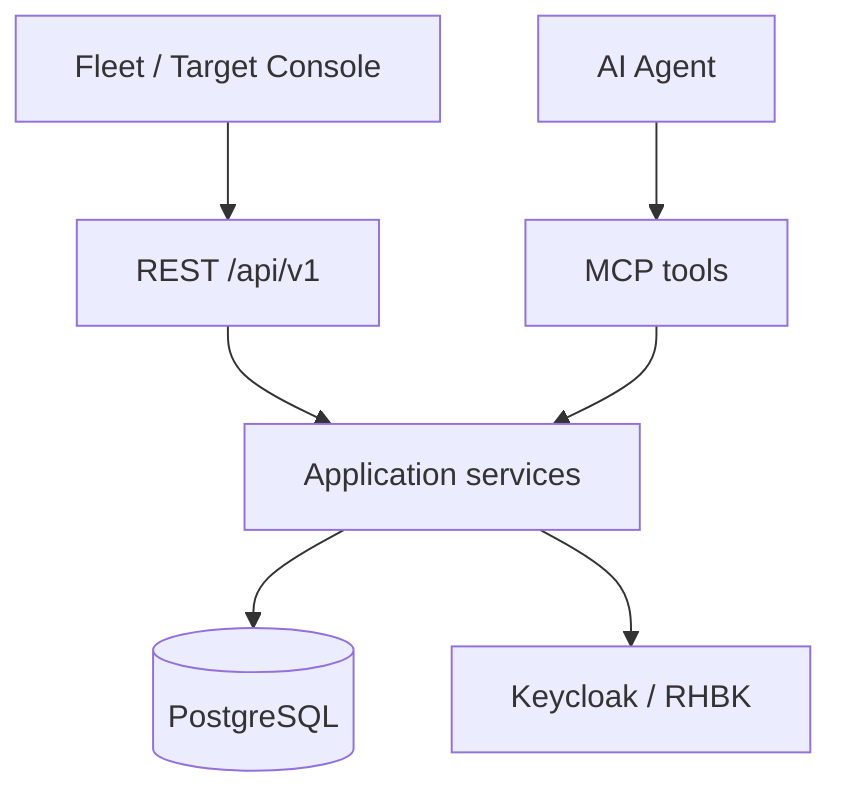

# UI architecture

The Operations Platform backend is UI-agnostic. The Fleet Operations Console consumes:

## Module layout

In-repo frontend: [`ui/`](../ui/) (React + TypeScript + Vite, Node ≥ 20).

Production packaging: **separate nginx static image** (`ui/Containerfile`). The Quarkus distribution does **not** embed UI assets — backend remains the security boundary; UI pods have no assessor ServiceAccount.

OpenShift manifests: `deploy/openshift/100-ui-deployment.yaml`, `110-ui-service.yaml`, `120-ui-route.yaml`.

## Surfaces

1. **Fleet dashboard** — `GET /api/v1/fleet`
2. **Target overview** — `GET /api/v1/targets/{targetId}/overview`
3. **Health / Assessment / Performance / Infrastructure / History** — existing `/api/v1` resources
4. **Live events** — SSE `GET /api/v1/events` (assessment/health completed; not metric graphs)

Conceptual UX notes remain under [`ui/`](ui/).

## Authn/authz

See [identity-model.md](identity-model.md). REST and MCP share `TargetAuthorizationService`. Default lab is OPEN_LAB; enable `%oidc` for Identity A.
